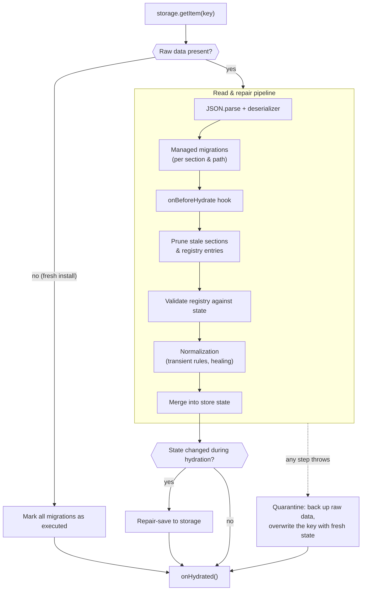

# 🧩 YASM — Yet Another State Management!

> Path-based, purgeable, composable state management for React — built on `useSyncExternalStore` and `immer`.

YASM organizes state as a grid of **Sections × Paths**. A _section_ defines the shape and update logic of a piece of state (like a mini-reducer), and a _path_ is a string address for one **instance** of that section. This makes YASM ideal for applications that open many instances of the same UI simultaneously—like an ERP with dozens of tabs, tables, and dialogs—and lets you **purge** everything under a path when a tab closes.

---

## ✨ Features

- 🗂️ **Multi-instance state**: The same section can live at unlimited paths. `useYasmState('UserTable', '/tabs/1/users')` and `useYasmState('UserTable', '/tabs/2/users')` are fully independent.
- 🧹 **Purgeable state**: Free all state under a path prefix in one call: `purge('/tabs/1')`. Segment-aware matching guarantees `/tabs/1` never touches `/tabs/10`.
- 🧬 **Composable sections**: `arraySectionGenerator` and `objectSectionGenerator` build parent sections whose children are addressable through **path routing**: `useYasmState('Row', '/table[3]')` reads/writes the row _inside_ the table state immutably, with parent subscribers notified.
- ⚡ **Precise re-renders**: Components subscribe per `(section, path)` and can narrow further with selectors. No top-down re-render cascades.
- ✍️ **Reducer-like updaters with Immer**: Write mutable code, get immutable updates. Updaters returning an unchanged state produce **no** notification churn (reference equality is preserved).
- 🦥 **Lazy initialization**: State is created on first use, optionally with `overrideInitialState` (object or function form).
- 🎯 **Payload creators**: `updater(state => payload)` reads the latest state at dispatch time, avoiding stale closures.
- 🧰 **Zero setup**: `createStore(sectionMap)` + one context provider. No actions, no dispatch strings, no boilerplate.
- 🛡️ **Safe async updates**: Updaters fired after a purge (from `setTimeout`, promises, or stale handlers) are silent no-ops instead of crashes.
- 🩺 **Dev diagnostics**: Helpful errors for unknown sections or missing providers, warnings when purging state that still has mounted subscribers, and opt-in state logging.
- 💾 **Built-in persistence**: Hydrate and save through any sync or async key-value storage, with debounced autosave, section omission, lifecycle hooks, deep normalization, and custom serialization.

---

## 📦 Installation

```bash
npm install @mrnafisia/yasm
# react >= 18.2 is a peer dependency (immer is included automatically)
```

---

## 🚀 Quick Start

```tsx
import {
    createStore,
    YasmContext,
    useYasmState,
    usePurgeYasmState,
    mergeUpdaterGenerator,
    type Section
} from '@mrnafisia/yasm';

// 1. Define sections
type CounterState = { count: number; label: string };
const counterSection: Section<CounterState, Partial<CounterState>> = {
    initialState: { count: 0, label: '' },
    updater: mergeUpdaterGenerator<CounterState>()
};

// 2. Create the store (once, outside components)
const store = createStore({ Counter: counterSection });

// 3. Provide it
const App = () => (
    <YasmContext.Provider value={store}>
        <Counter path="/tabs/1/counter" />
        <Counter path="/tabs/2/counter" />
    </YasmContext.Provider>
);

// 4. Use it — each path is an independent instance
const Counter = ({ path }: { path: string }) => {
    const [count, update] = useYasmState('Counter', path, s => s.count);
    return (
        <button onClick={() => update(s => ({ count: s.count + 1 }))}>
            {count}
        </button>
    );
};
```

💡 In real applications you will usually wrap `useYasmState` in a strongly-typed app hook so that section names, states, and payloads are fully typed — see **💎 TypeScript: Strongly Typed Hooks** below.

---

## 💎 TypeScript: Strongly Typed Hooks

The Quick Start calls `useYasmState` directly — perfectly fine for demos. In a real app, however, TypeScript **cannot infer your section types** from the call site. The reason is simple: the hook never receives your section map. Your store is created _outside_ the component tree (in `store.ts`), and the hook only receives loose `string` arguments, so the generics fall back to their wide defaults — section names are plain strings and the state is untyped.

The industry-standard solution is a **typed wrapper hook**: create your store once, derive its `SectionMap` type, and re-export a thin `useAppState` hook bound to it.

Why the one-time setup is worth it:

- 🧠 **Full inference** — state, selector results, updater payloads, and `overrideInitialState` are precisely typed per section.
- ✍️ **Autocomplete & typo safety** — section names autocomplete in the IDE; a typo like `'Couter'` becomes a compile-time error instead of a runtime surprise.
- 🧩 **One source of truth** — the wrapper is the single place where your app's store type enters the React layer.

Create the wrapper next to your store definition (e.g. `src/store/hooks.ts`):

```ts
import { useYasmState } from '@mrnafisia/yasm';
import { store } from './index';

// 1. Derive the section map type from the initialized store
type SectionMap = typeof store.sectionMap;

type Updater<Name extends keyof SectionMap> = (
    payload:
        | Parameters<SectionMap[Name]['updater']>[1]
        | ((
              state: SectionMap[Name]['initialState']
          ) => Parameters<SectionMap[Name]['updater']>[1])
) => SectionMap[Name]['initialState'] | void;

type OverrideInitialState<Name extends keyof SectionMap> =
    | Partial<SectionMap[Name]['initialState']>
    | ((
          initialState: SectionMap[Name]['initialState']
      ) => Partial<SectionMap[Name]['initialState']>);

// 2. Overload 1: basic use (no selector) or use with a selector
function useAppState<Name extends keyof SectionMap, State>(
    name: Name,
    path: string,
    selector?: (state: SectionMap[Name]['initialState']) => State
): [
    unknown extends State ? SectionMap[Name]['initialState'] : State,
    Updater<Name>
];

// 3. Overload 2: use with an options object (selector and/or overrideInitialState)
function useAppState<Name extends keyof SectionMap, State>(
    name: Name,
    path: string,
    options: {
        selector?: (state: SectionMap[Name]['initialState']) => State;
        overrideInitialState?: OverrideInitialState<Name>;
    }
): [
    unknown extends State ? SectionMap[Name]['initialState'] : State,
    Updater<Name>
];

// 4. Implementation signature: delegate to useYasmState and retype the result
function useAppState<Name extends keyof SectionMap, State>(
    name: Name,
    path: string,
    thirdParam?:
        | ((state: SectionMap[Name]['initialState']) => State)
        | {
              selector?: (state: SectionMap[Name]['initialState']) => State;
              overrideInitialState?: OverrideInitialState<Name>;
          }
) {
    return useYasmState(
        name,
        path,
        thirdParam as Parameters<typeof useYasmState>[2]
    ) as [
        unknown extends State ? SectionMap[Name]['initialState'] : State,
        Updater<Name>
    ];
}
```

Now replace every `useYasmState` call in your components with `useAppState`:

```ts
const [count, update] = useAppState('Counter', '/tabs/1/counter', s => s.count);
//                                    ^^^^^^^^^ autocompletes
update({ count: 5 }); // ✅ payload fully typed
update({ cont: 5 }); // ❌ compile-time error
```

### Write-Only Access (`useYasmStateUpdater`)

Many components only _dispatch_ — submit buttons, toolbar actions, debounced savers — and never read the state they write to. They should not re-render when that state changes.

YASM ships a hook for exactly this. `useYasmStateUpdater` returns only the updater and **never subscribes** the calling component — the store does not even notify it when the state changes, so it cannot re-render:

```tsx
import { useYasmStateUpdater } from '@mrnafisia/yasm';

const resetCounter = useYasmStateUpdater('Counter', '/tabs/1/counter');

// This button renders once and never re-renders, even if the counter
// updates a thousand times per second:
<button onClick={() => resetCounter({ count: 0 })}>Reset</button>;
```

For fully typed access (autocomplete + typed payloads), forward it through your app's `SectionMap`:

```ts
const useAppStateUpdater = <Name extends keyof SectionMap>(
    name: Name,
    path: string
) => useYasmStateUpdater<SectionMap, Name>(name, path);
```

How it works — and the manual alternative: every component subscribed to a `(section, path)` is notified after each update, and React re-renders it unless the selected value is reference-equal to the previous one. With raw `useYasmState` you can opt out of re-renders by passing the constant selector `() => null` and destructuring only the updater. The component stays subscribed, but React always bails out because the selected `null` never changes:

```ts
const [, update] = useYasmState('Counter', '/tabs/1/counter', () => null);
```

> ⚠️ **Warning**: If you destructure the state anyway (`const [state, update] = useYasmState(...)`), the component subscribes to the full state at that path and re-renders on every change of it — even if `state` is never read. Destructure only the updater (`const [, update] = ...`) or use `useYasmStateUpdater`.

---

## 🧠 Core Concepts

### Mental Model

YASM answers three questions about every piece of state:

| Question                    | Concept     | Example                                   |
| :-------------------------- | :---------- | :---------------------------------------- |
| _What kind_ of state is it? | **Section** | `UserRow` (shape + update logic)          |
| _Which instance_ of it?     | **Path**    | `/tabs/1/users[7]`                        |
| _Where_ does it live?       | **Routing** | Independently, or inside a parent section |

A section is reusable logic; paths give you unlimited instances of it for free; routing optionally nests an instance inside another section's state instead of storing it on its own.

### Sections

A section is `{ initialState, updater, routing?, normalize?, persist? }`. The updater is Immer-powered: mutate the draft **or** return a new state.

```ts
type Todo = { id: number; title: string };
const todoSection: Section<Todo[], { add: Todo }> = {
    initialState: [],
    updater: (state, { add }) => {
        state.push(add); // mutate freely — immer handles immutability
    }
};
```

### Paths

Paths are plain strings, but by convention, they are hierarchical: `/tabs/12/users/table`. Segments are separated by `/`, `[`, or `.`. Purging and routing are **segment-aware**: `/tabs/1` covers `/tabs/1/x` and `/tabs/1[3]` but **not** `/tabs/10`.

The boundary characters default to `'/'`, `'['`, and `'.'` (exported as `DEFAULT_PATH_BOUNDARY_CHARS`). If your paths follow a different convention, customize them when creating the store — purge matching and routing resolution both use the configured set:

```ts
const store = createStore(sectionMap, {
    // extend the defaults, or replace them entirely (e.g. just ['/', '~'])
    pathBoundaryChars: defaultChars => [...defaultChars, '~']
});
```

### Updaters & Payload Creators

```ts
const [state, update] = useYasmState('Counter', '/c');

update({ count: 5 }); // Payload
update(prev => ({ count: prev.count + 1 })); // Payload creator (reads latest state)
```

YASM also ships updater factories and a setter helper. Both factories return the **same state reference** when nothing actually changes, so no-op updates produce no notifications:

```ts
const counterUpdater = mergeUpdaterGenerator<CounterState>(); // Partial<S> shallow merge
const fieldUpdater = propertyUpdaterGenerator<CounterState>(); // { key, value } payload

// Cached per-field setters with stable references (safe for dependency arrays):
const setCount = getFieldSetter(update, 'count');
setCount(5);
setCount(prev => prev + 1);
```

The setter cache is keyed by the updater function — and YASM keeps the updater reference stable per `(section, path)` — so the same setter reference survives re-renders and remounts, and is safe to use in dependency arrays.

> ⚠️ **Enable `exactOptionalPropertyTypes` — seriously!**
>
> Every partial-payload API in YASM (`mergeUpdaterGenerator` payloads, `overrideInitialState`, ArraySection `partialState`, and ObjectSection child payloads) is typed with **optional properties**. Under TypeScript's default behavior, an optional property also accepts an **explicit `undefined`** — so this compiles without any complaint:
>
> ```ts
> // age is typed `number` — and we just silently made it undefined!
> updateState({ age: undefined });
> ```
>
> At runtime the merge overwrites `age` with `undefined`, breaking every invariant that expects a number. The fix is one compiler flag (which — surprisingly — is **not** part of `strict`):
>
> ```json
> // tsconfig.json
> {
>     "compilerOptions": {
>         "strict": true,
>         "exactOptionalPropertyTypes": true
>     }
> }
> ```
>
> With the flag enabled, the assignment above becomes a **compile-time error**, while fields that are _genuinely_ nullable (`age?: number | undefined`) remain fully assignable. This is the single most important tsconfig flag for YASM users.

### Selectors & Overrides

```ts
const [label] = useYasmState('Counter', '/c', s => s.label);

const [state, update] = useYasmState('Counter', '/c', {
    selector: s => s,
    overrideInitialState: { count: 100 } // Used only on first initialization
});
```

> ⚠️ **Warning**: Selectors must return **stable** values for unchanged state (primitives, or references stored in state). A selector that builds a new object/array on every call will cause infinite re-renders under `useSyncExternalStore`.

---

## 🧬 Composition & Routing

Composition lets one section store its state **inside another section**. The parent owns the single copy of the data; child hooks address slices of it through **path routing**. One source of truth, two views: `useYasmState('UserTable', '/users')` sees the whole table, while `useYasmState('UserRow', '/users[7]')` reads and writes row 7 _inside_ that same table state — immutably, with the parent's subscribers notified.

Both the parent and every child must be registered in `createStore`: the child section defines the shape and updater of its slice, and the composed parent defines how slices are addressed.

> ⚠️ **Strict bracket syntax**: the built-in generators address children with `[id]` / `[key]` segments. `/users/7` is **not** the same as `/users[7]` — it matches the parent prefix but then fails routing with an "invalid ArraySection path" error when read. Only bracket segments select into composed sections.

### ArraySection

```ts
const store = createStore({
    UserTable: arraySectionGenerator('UserRow', userRowSection),
    UserRow: userRowSection
});

// Parent: the whole table
const [table, updateTable] = useYasmState('UserTable', '/users');
updateTable({
    addingItems: [{ id: 7, partialState: { name: 'Sara' } }],
    order: [7]
});

// Child: one row, addressed *through* the parent
const [row, updateRow] = useYasmState('UserRow', '/users[7]');
updateRow({ name: 'Sara A.' }); // Immutably updates the row inside the table
```

The parent state is an ordered map: `{ order: number[]; map: Record<number, S> }` — `order` holds row ids in display order, `map` holds the row states keyed by id. So `table.map[7]` is exactly what `row` reads through the child hook.

> ⚠️ **IDs are not array indexes**: `[7]` means the row with **id 7** (the key in `map`), not the seventh row. `order` alone controls display/iteration order; `map` is the lookup. With `order: [20, 5, 100]`, the second rendered row is `/users[5]` (`map[5]`) — even though it sits at index 1.

The `updater` payload supports `order`, `addingItems`, `editingItems`, and `removingIDs`. These are applied in the order: **order → removals → additions → edits**, allowing you to add and edit the same item in a single update.

- `addingItems` merges each `partialState` over the child section's `initialState`.
- `editingItems` runs the child section's own updater on the row; an id missing from `map` is skipped with a development warning.
- `removingIDs` deletes rows from `map` only — keeping `order` in sync is your responsibility. A stale id in `order` points at a removed row and throws a "has not been initialized" error when routed to.

### ObjectSection

```ts
const profileState = { firstName: '', lastName: '' };
const addressState = { city: '', street: '' };
const profileUpdater = mergeUpdaterGenerator<typeof profileState>();
const addressUpdater = mergeUpdaterGenerator<typeof addressState>();

// The composed parent: each entry maps a local key to a registered child section
const formSection = objectSectionGenerator({
    profile: { name: 'Profile', state: profileState, updater: profileUpdater },
    address: { name: 'Address', state: addressState, updater: addressUpdater }
});

const store = createStore({
    Form: formSection,
    // ⚠️ Children must be registered too, under the same names used above —
    // otherwise YASM logs 'there is no "X" section to have a route on!'
    Profile: { initialState: profileState, updater: profileUpdater },
    Address: { initialState: addressState, updater: addressUpdater }
});

// Parent: the whole form
const [form, updateForm] = useYasmState('Form', '/form');
updateForm({ profile: { firstName: 'Sara' } });

// Child: one field group, addressed through the parent
const [profile, updateProfile] = useYasmState('Profile', '/form[profile]');
updateProfile({ lastName: 'A.' });
```

ObjectSection is not an object-merge helper — it creates **routing boundaries**. Each child keeps owning its own state shape and updater; the parent only owns placement (where the child lives inside its state).

### Deep / Nested Composition

Routers compose recursively: a composed child can itself be a composed parent. A table of rows, where each row is a form:

```ts
const rowForm = objectSectionGenerator({
    profile: { name: 'Profile', state: profileState, updater: profileUpdater },
    settings: { name: 'Settings', state: settingsState, updater: settingsUpdater }
});

const store = createStore({
    Table: arraySectionGenerator('Row', rowForm),
    Row: rowForm, // the composed row doubles as ArraySection child and routing parent
    Profile: { initialState: profileState, updater: profileUpdater },
    Settings: { initialState: settingsState, updater: settingsUpdater }
});

useYasmState('Table', '/table');                // the whole table
useYasmState('Row', '/table[5]');               // row 5 (the whole form)
useYasmState('Profile', '/table[5][profile]');  // just the profile of row 5
```

The path query is evaluated level by level — `[5]` selects the row inside the table, then the remaining `[profile]` is handed to the row's own routing. Note that each intermediate level must be in use first (its path is registered when a hook at that path initializes), following the parent-first rule below.

### How Routing Works

- **Registration**: when a parent path (e.g. `/users`) is first used, YASM records it in an internal `pathRegistry`. A child hook like `useYasmState('UserRow', '/users[7]')` resolves its parent by segment-aware matching against registered paths, then applies the parent's router: `[7]` selects row 7 from the table state. Any remaining path continues through deeper registered routing, so **multi-level composition works** — a row can itself be a composed section with its own children.
- **Initialize the parent first**: the registry entry is created when the parent path is initialized. If a child path is used before its parent path exists (fresh session, parent not yet mounted), routing cannot resolve and YASM falls back to storing that child's state directly. After hydration the registry is restored from persistence, so children route correctly even before the parent component mounts — this is exactly why YASM persists `pathRegistry`.
- **Notifications**: a child update produces a new parent state immutably, so subscribers of the parent path are notified (the table view re-renders). Child hooks use their own selectors, which keeps their re-renders precise — a row only re-renders when its selected slice actually changed.
- **Custom routers**: the `routing` field of a section accepts a `Router` (`selectByPathQuery` / `updateByPathQuery`) per child name, so you can build your own composition shapes. You rarely need to — the two generators cover the common cases.

> ⚠️ **Warning**: Registered routing paths must not be nested within each other. YASM logs an error in development if a path is a segment-prefix of another registered path of a routing section.

### Custom Routers

If brackets don't fit your mental model — or you need a different data structure, like a plain dictionary — define the `routing` field yourself. A `Router` provides `selectByPathQuery` (resolve the child state from the remaining path) and `updateByPathQuery` (apply the child's new state immutably into the parent). Here is a dictionary router using dot-notation (`.key`) instead of brackets:

```ts
const dictionarySection: Section<
    Record<string, ChildState>,
    Record<string, Partial<ChildState>>
> = {
    initialState: {},
    updater: (state, payload) => {
        for (const key in payload) {
            state[key] = { ...state[key], ...payload[key] };
        }
    },
    routing: {
        // The key must match the child's registered section name
        Child: {
            // pathQuery is the part after the registered parent path,
            // e.g. '.user1' for useYasmState('Child', '/dict.user1')
            selectByPathQuery: (state, pathQuery) => {
                const key = pathQuery.slice(1); // strip the leading '.'
                if (state[key] === undefined) {
                    throw new Error(`YASM: unknown dictionary key "${key}".`);
                }
                return [state[key], '']; // child state + unused remainder
            },
            updateByPathQuery: (state, pathQuery, getChildState) => {
                const key = pathQuery.slice(1);
                const newChild = getChildState(state[key], '');

                // 🔒 No-op bailout: an unchanged child keeps the parent reference
                if (newChild === state[key]) {
                    return state;
                }

                return { ...state, [key]: newChild };
            }
        }
    }
};
```

Since `.` is one of the default boundary characters, `/dict.user1` segment-matches the registered parent path `/dict` and routes through the custom router — the same mechanics the generators use, just a different query syntax.

---

## 🧹 Purging

```tsx
const purge = usePurgeYasmState();

// When tab 12 closes:
purge('/tabs/12'); // Removes state, subscribers, memo records & path registrations
```

- Matching is **segment-aware** by default. Pass `{ match: 'startsWith' }` for legacy raw-prefix behavior.
- Purge **after** the components using that state have unmounted (e.g., from a `useEffect` with a `setTimeout` at the app root). In development, YASM warns _at purge time_ if subscribers are still attached, specifying the exact section and path.
- Purging is idempotent and never throws for unknown/already-purged paths or stale sections restored from persistence.
- Outside React (tests, event buses), use the pure function: `purgeYasmState(store, '/tabs/12')`.

---

## 💾 Persistence

Persistence is configured in the second argument to `createStore`. YASM saves `store.state`, `store.pathRegistry`, and a small `metadata` record (used for migration bookkeeping). The registry is required to restore composition/routing correctly.

The full hydration pipeline, in execution order:



The storage adapter may be synchronous or asynchronous and must provide the following shape:

```ts
type YasmPersistenceAdapter = {
    getItem(key: string): string | null | Promise<string | null>;
    setItem(key: string, value: string): void | Promise<void>;
    removeItem(key: string): void | Promise<void>;
    clear?(): void | Promise<void>;
};
```

### Browser Example with `localStorage`

```tsx
import { ReactNode, useEffect, useState } from 'react';
import { createStore, YasmContext } from '@mrnafisia/yasm';

const store = createStore(
    {
        BaseInfo: baseInfoSection,
        UserTable: userTableSection,
        UserManage: userManageSection
    },
    {
        persist: {
            key: 'my-app:yasm-state',
            storage: window.localStorage,

            // Do not persist permissions, tokens, temporary UI, etc.
            omitSections: ['BaseInfo'],

            // Save after YASM updates and purges, debounced by 1.5 seconds.
            autoSave: true,
            persistDebounceMS: 1500,

            onHydrated: () => {
                console.info('YASM state restored');
            }
        }
    }
);

export const StoreProvider = ({ children }: { children: ReactNode }) => {
    const [ready, setReady] = useState(false);

    useEffect(() => {
        let cancelled = false;

        store.hydrate().finally(() => {
            if (!cancelled) setReady(true);
        });

        return () => {
            cancelled = true;
        };
    }, []);

    return (
        <YasmContext.Provider value={store}>
            {/* Critical: do not mount any useYasmState consumers before hydration finishes */}
            {ready ? children : null}
        </YasmContext.Provider>
    );
};
```

> ⚠️ **Race Condition Warning**
> Call `store.hydrate()` **once** during application startup **and before mounting any component that calls `useYasmState`**.
> If a component initializes a path before `hydrate()` finishes, the path is created with the current `initialState`. When the persisted data later arrives, it is shallow-merged, which can produce surprising results or overwrite user actions that happened in the meantime.
> `hydrate()` always resolves (even on failure). If the stored snapshot is corrupted, YASM backs it up to a quarantine key and starts fresh — see **Corrupted Snapshot Handling** below.

### LocalForage / IndexedDB Adapter

`localforage` (and most IndexedDB wrappers) return the raw value, not necessarily a string. Wrap it so `getItem` always yields the serialized string that YASM expects:

```ts
import localforage from 'localforage';

const storage = {
    getItem: (key: string) => localforage.getItem<string>(key),
    setItem: (key: string, value: string) =>
        localforage.setItem(key, value).then(() => undefined),
    removeItem: (key: string) => localforage.removeItem(key),
    clear: () => localforage.clear()
};

const store = createStore(sectionMap, {
    persist: {
        key: 'yasmState',
        storage,
        autoSave: true
    }
});
```

### Corrupted Snapshot Handling (Quarantine)

If anything goes wrong while reading or repairing the stored snapshot — invalid JSON, a failing migration, a throwing `onBeforeHydrate` hook — YASM never crashes and never keeps broken data in the primary key. Instead it **quarantines** the corruption:

1. If raw data could be read, it is backed up untouched to a new storage key: `<key>_corrupted_backup_<ISO-timestamp>` (e.g. `yasmState_corrupted_backup_2026-08-22T14-30-05-123Z`), so nothing is ever lost.
2. The main `<key>` is overwritten with a clean, fresh state, removing the corrupted data from the primary key.
3. The session continues unlocked — new updates, autosaves, and manual saves work normally from the fresh state.

```ts
// After a corrupted hydration you will find in storage:
// 'yasmState'                      → clean fresh snapshot
// 'yasmState_corrupted_backup_...' → the untouched corrupted raw data
```

⚠️ Quarantine backups accumulate over time. Prune old `<key>_corrupted_backup_*` entries yourself if your users hit repeated corruption.

### Manual Save & Autosave

```ts
await store.save(); // Save immediately, e.g., for Ctrl/Cmd+S
```

- `autoSave` defaults to `false`. It may be a boolean or `() => boolean` for runtime control.
- `persistDebounceMS` defaults to `1000`. It may be a number or `() => number`.
- Autosave is scheduled after YASM state updates and successful purges. In browsers, it uses `requestIdleCallback` when available, with a `setTimeout` fallback.
- `store.save()` is always available and bypasses the debounce. It does nothing when no `persist` configuration is supplied.
- `store.save()` captures the state snapshot at the exact moment it is called. Concurrent saves are serialized through an internal FIFO queue, so the newest completed write always wins.
- ⚠️ Autosave is debounced. If the app closes within the debounce window, the last changes are lost. Flush manually with `await store.save()` from a `pagehide` or `visibilitychange` listener when needed.

### Excluding Sections

Use `omitSections` for sensitive, stale, or transient sections. Omitted sections (and their `pathRegistry` entries) are excluded from the snapshot entirely; they initialize lazily from their `initialState` the next time they are used.

```ts
persist: {
    key: 'yasmState',
    storage,
    omitSections: ['Credential', 'TemporaryUI']
}
```

Or compute the list dynamically at save time:

```ts
omitSections: state =>
    state.Credential['/credential']?.rememberMe
        ? ['TemporaryUI']
        : ['Credential', 'TemporaryUI'];
```

Both the `state` and the `pathRegistry` entries of omitted sections are excluded, ensuring nothing from these sections ever reaches storage.

**Alternatively, exclude a section at its definition** with `persist: false`. While `omitSections` is configured on the store (and can be dynamic), `persist` is declared on the section itself — a permanent, declarative opt-out that travels with the section definition:

```ts
const credentialSection: Section<CredentialState, CredentialPayload> = {
    initialState: { token: '', refreshToken: '' },
    updater: credentialUpdater,
    persist: false // 🔒 never persisted — lives in memory for the session only
};
```

- The section behaves completely normally in memory during the session; it simply never reaches storage and starts fresh from its `initialState` on every boot.
- Both mechanisms combine: a section is excluded whenever it is listed in `omitSections` (statically or dynamically) **or** has `persist: false`.
- `persist` is fixed at definition time — for state-dependent decisions (e.g. "persist credentials only if _remember me_ is checked"), use the function form of `omitSections` instead.

### Custom Serialization (`Date`, `BigInt`, `Decimal`, …)

Pass a JSON replacer-compatible `serializer` and reviver-compatible `deserializer` at the **top level** of the store options. They are used by persistence and debug snapshots.

```ts
const BIGINT_PREFIX = '$$BIGINT$$_';
const DECIMAL_PREFIX = '$$DECIMAL$$_';

const store = createStore(sectionMap, {
    serializer(object, key, value) {
        // `object` points to the parent holding the current key
        const original = object[key];

        if (typeof original === 'bigint') {
            return BIGINT_PREFIX + original.toString();
        }
        if (Decimal.isDecimal(original)) {
            return DECIMAL_PREFIX + original.toJSON();
        }
        return value;
    },
    deserializer(_key, value) {
        if (typeof value === 'string' && value.startsWith(BIGINT_PREFIX)) {
            return BigInt(value.slice(BIGINT_PREFIX.length));
        }
        if (typeof value === 'string' && value.startsWith(DECIMAL_PREFIX)) {
            return new Decimal(value.slice(DECIMAL_PREFIX.length));
        }
        // Prefer explicit prefixes over heuristic ISO-date detection
        return value;
    },
    persist: {
        key: 'yasmState',
        storage,
        autoSave: true
    }
});
```

### Preventing String Collisions

If you use string prefixes (like `$$BIGINT$$_`) for custom serialization, you must protect against users typing that exact prefix into a standard string input. If a user types `"$$BIGINT$$_123"` in a text field, the deserializer will mistakenly convert it into a `BigInt`!

To prevent this silent data corruption, implement a **Universal String Escape Mechanism**. By unconditionally prefixing _all_ strings with a dedicated tag (e.g., `$$STR$$_`), you guarantee that any string input is safely restored as a string, regardless of its contents.

#### Complete Example

The following self-contained pair implements the universal string escape and follows the explicit-prefix advice from above — dates get their own `$$DATE$$_` tag instead of heuristic ISO-string guessing:

```ts
function serializer(
    object: Record<string, unknown>,
    key: string,
    value: unknown
) {
    if (typeof object[key] === 'bigint') {
        return '$$BIGINT$$_' + object[key].toString();
    }

    if (Decimal.isDecimal(object[key])) {
        return '$$DECIMAL$$_' + object[key].toJSON();
    }

    if (object[key] instanceof Date) {
        return '$$DATE$$_' + object[key].toISOString();
    }

    // 🛡️ Escape mechanism for primitive strings:
    // We prepend `$$STR$$_` to ALL strings to prevent accidental type corruption.
    // If a user types exactly "$$BIGINT$$_123" in a text field, without this escape tag,
    // the deserializer would mistakenly convert that string input into a real BigInt object!
    // By wrapping it here, it becomes "$$STR$$_$$BIGINT$$_123", ensuring the deserializer
    // safely strips the string tag and restores the exact original text.
    if (typeof object[key] === 'string') {
        return '$$STR$$_' + object[key];
    }

    return value;
}

function deserializer(key: string, value: unknown) {
    if (typeof value !== 'string') {
        return value;
    }

    if (value.startsWith('$$BIGINT$$_')) {
        return BigInt(value.slice('$$BIGINT$$_'.length));
    }

    if (value.startsWith('$$DECIMAL$$_')) {
        return new Decimal(value.slice('$$DECIMAL$$_'.length));
    }

    if (value.startsWith('$$DATE$$_')) {
        return new Date(value.slice('$$DATE$$_'.length));
    }

    if (value.startsWith('$$STR$$_')) {
        return value.slice('$$STR$$_'.length);
    }

    return value;
}

const store = createStore(sectionMap, {
    serializer,
    deserializer,
    persist: {
        key: 'yasmState',
        storage,
        autoSave: true
    }
});
```

💡 Best Practice Note: Notice the use of `value.slice('$$STR$$_'.length)` instead of `value.replace`. Using `.slice` is significantly faster because it simply trims the start of the string without running a search operation. It also prevents dangerous bugs where developers might accidentally use a global Regex (e.g., `.replace(/\$\$STR\$\$_/g, '')`) which would severely corrupt the user's data if they naturally typed that exact string in the middle of a sentence.

### Lifecycle Hooks and Fully Custom Persistence

```ts
persist: {
    key: 'yasmState',
    storage,

    onBeforeSave: snapshot => {
        // Observe or prepare the snapshot (omissions already applied)
        // immediately before serialization.
        // ⚠️ Read-only: value objects are shared with the live store —
        // never mutate them.
    },

    // Runs after managed migrations and after JSON.parse + deserializer,
    // but *before* normalization & merge. Use it for arbitrary final
    // snapshot transformations.
    onBeforeHydrate: snapshot => {
        // mutate snapshot.state / snapshot.pathRegistry in place
    },

    onHydrated: () => {
        // Safe to start services that depend on restored state
    },

    // Runs after the built-in storage write (or alone for a fully custom backend)
    customPersistCallback: async snapshot => {
        await sendSnapshotToServer({
            state: snapshot.state,
            pathRegistry: snapshot.pathRegistry
        });
    }
}
```

`customPersistCallback` can be used without `key`/`storage` for a completely custom save destination. Hydration, however, still requires the built-in `key` + `storage` pair; custom loading must be performed by the consumer before mounting the provider.

### State Normalization & Transient Fields

By default, YASM normalizes every restored path against the section’s current `initialState` before merging it into the store. This makes ordinary schema evolution safe. We have deep native support for resetting transient properties through configuration options.

```ts
persist: {
    key: 'yasmState',
    storage,
    normalization: {
        // Default true — remove fields that no longer exist in initialState
        pruneStaleFields: true,

        // Reset matching fields to their initialState values globally
        transientPatterns: [/loading/i, /isLoading/i, /submitting/i],

        // Exact field names reset explicitly per section.
        // Note: Thanks to "Deep Normalization", this natively works for children of ArraySections and ObjectSections!
        transientExact: {
            UserTable: ['selectedRowId'],
            Row: ['isLoading'] // Works seamlessly for items inside tables!
        },

        // Fully custom rule matching evaluation
        isTransient: (sectionName, fieldName) =>
            sectionName === 'UserManage' && fieldName === 'draftToken'
    }
}
```

- **Added fields**: Properties present in the current `initialState` but missing from the persisted data receive their initial values.
- **Removed fields**: With `pruneStaleFields: true` (default), they are deleted. Set to `false` for sections whose state is intentionally a dynamic dictionary.
- **Transient fields**: Matched fields are reset to the current `initialState` value. This prevents a page refresh that occurs while a request is in flight from restoring `isLoading: true` with no remaining callback that would ever clear it.
- **Deep Normalization**: When a `Section` has a `normalize` hook (like those generated by `arraySectionGenerator` or `objectSectionGenerator`), YASM traverses the composed rows/children and applies your transient rules with the child section's name. This covers one composition level (e.g., rows of a table). For nested compositions (a composed section inside another), provide a custom `normalize` hook on the outer section that recurses itself.
- **Corruption healing**: On hydration, `ArraySection` order data is healed: duplicate IDs are deduplicated, stringified IDs are coerced back to numbers, and non-numeric entries or IDs without a matching map item are dropped.

Pass `normalization: false` to disable the whole step.

YASM also drops sections that no longer exist in the current `sectionMap` and filters `pathRegistry` entries that point at removed sections, ensuring an old persisted snapshot cannot leave stale routing data behind.

### Migrations (Application-Specific)

**Why migrations exist at all**: persisted state outlives your deployments. The snapshot in your storage (e.g., IndexedDB via `localforage`) is restored on every page reload, so a user can boot today's app with data that was written weeks ago — by an older version of your sections, shaped by an older schema. Migrations bring those stored values forward to the current schema, so a refresh never costs the user their state.

Normalization covers the common "add / remove field" cases. For renames, type changes, or any other structural transformation, you need a real migration.

**When you must write a migration:**

- ✅ **Renaming a field** of a section → migrate the old name to the new one.
- ✅ **Changing a field's type** (e.g. `string` date → `Date`) → convert the stored value.
- ❌ **Adding or removing a field** → no migration needed — normalization fills added fields from `initialState` and prunes removed ones on every hydration.

**Use `migrations`**. YASM natively manages schema tracking and prevents duplicate executions. Migrations are mapped directly to specific Sections.

⚠️ **Typing tip — avoid a circular inference trap**: if you type your migrations constant with `keyof typeof store.sectionMap` and pass that same constant into `createStore`, TypeScript hits a circular reference and both collapse to `any`. Derive the type from a named section map instead:

```ts
import { createStore, type StateMigration } from '@mrnafisia/yasm';

// 1. Name the section map so its type can be derived BEFORE the store exists
const APP_SECTIONS = {
    TransactionManage: transactionManageSection
    // ...your sections
};

// 2. Type migrations from the section map — not from `store`
const APP_STATE_MIGRATIONS: Partial<
    Record<keyof typeof APP_SECTIONS, StateMigration[]>
> = {
    TransactionManage: [
        {
            id: '2026-04-27T13:02:00.000Z',
            migrate: storedValue => {
                // Rename
                if ('loading' in storedValue) {
                    storedValue.isLoading = storedValue.loading;
                    delete storedValue.loading;
                }

                // Type change
                if (typeof storedValue.date === 'string') {
                    storedValue.date = new Date(storedValue.date);
                }
            }
        }
    ]
};

// 3. Create the store from the same named map
const store = createStore(APP_SECTIONS, {
    persist: {
        key: 'yasmState',
        storage,
        autoSave: true,
        migrations: APP_STATE_MIGRATIONS
    }
});
```

**Notes:**

- Migration ids must be unique **within a section** — YASM validates this at `createStore` and throws on duplicates (a duplicate id would be silently skipped during hydration, since executed-tracking is keyed by `${sectionName}/${id}`). Keeping ids globally unique is still good hygiene; the ISO date convention makes that easy: use the ISO date string of the change, optionally prefixed with a short description for context — `'2026-04-27T13:02:00.000Z'` or `'delete-legacy-loading/2026-04-27T13:02:00.000Z'` — ids then sort chronologically in the persisted metadata.
- The `migrate` callback receives the stored value typed as `Record<string, unknown>` — **intentionally**, since the data was written by an older schema. Guard field accesses with `in` / `typeof` (as in the example above); typing migrations against the section's *current* shape breaks rename flows at compile time. You can still opt into a concrete type with `StateMigration<MySectionState>`.
- Migrations must be idempotent; they may run again after a hard reload if the bookkeeping entry is lost.
- On a fresh install (empty storage), every configured migration is immediately marked as executed—natively created state already matches the current schema.
- A migration that produces fields absent from the section's `initialState` will see them pruned afterwards by default normalization (`pruneStaleFields: true`).
- Do **not** put migration logic in `onBeforeSave`—that only affects future writes, never the data that is being read.

---

## 🧪 Generic Sections

```ts
const createValueSection = <T>(initial: T): Section<{ value: T }, T> => ({
    initialState: { value: initial },
    updater: (state, payload) => {
        state.value = payload;
    }
});

const store = createStore({
    Volume: createValueSection<number>(50),
    Theme: createValueSection<'light' | 'dark'>('light')
});
```

A single section cannot be generic at the call site (`useYasmState<'Array', number>(...)`) because TypeScript generics are erased. The idiomatic pattern is one `unknown`-typed section plus a thin typed wrapper hook:

```ts
const useValueState = <T>(path: string, initial: T) => {
    const [state, update] = useYasmState('GenericValue', path, {
        selector: s => s.value as T,
        overrideInitialState: { value: initial }
    });
    return [state, (value: T) => update({ value })] as const;
};
```

---

## 💡 Tips & Notes

- 🏷️ **Name paths after your UI hierarchy** (`/tabs/{id}/...`) so a single purge call cleans a whole tab.
- 🧯 **Don’t purge paths that are still rendered.**
- 🔁 **Don’t subscribe to state you only write.** Use `useYasmStateUpdater` — or, with raw `useYasmState`, the constant selector `() => null` (see **Write-Only Access** under 💎 TypeScript: Strongly Typed Hooks).
- 💾 **Use normalization for ordinary schema changes**; use `migrations` for real application structural changes.
- 🐞 **Debugging options** live under `debugOptions` (all dev-only — never active in production):
    - `logStateUpdates: true` — log every state update and purge.
    - `logStateUpdates: event => boolean` — **filter callback**: decide per event whether it should be logged. Highly recommended for busy apps where full logging is too noisy.
    - `snapshotScope: 'local' | 'full'` (default `'local'`)
    - `purgeSnapshotScope: 'none' | 'full'` (default `'none'`)

    The callback receives a `LogEvent` describing what is about to be logged:

    ```ts
    type LogEvent =
        | {
              type: 'update';
              sectionName: string;
              path: string;
              payload: unknown;
          }
        | { type: 'purge'; pathPrefix: string };
    ```

    For example, log only updates of one section and purges under one tab:

    ```ts
    const store = createStore(sectionMap, {
        debugOptions: {
            logStateUpdates: event =>
                event.type === 'purge'
                    ? event.pathPrefix.startsWith('/tabs')
                    : event.sectionName === 'TransactionTable'
        }
    });
    ```

    When the callback form is used, matching entries are tagged `YASM (Filtered)` in the console (with a colored badge) so you can tell them apart from the plain full-logging output.

- 🧊 **Direct mutations throw in development**: when a path is first initialized, YASM deep-freezes its state (development only, `NODE_ENV !== 'production'`). Mutating state outside of updaters fails fast with a `TypeError` instead of silently corrupting the store; the check is skipped in production builds for performance.
- ⚠️ **Enable `exactOptionalPropertyTypes` in your tsconfig** — otherwise `updateState({ age: undefined })` compiles even when `age: number` and silently corrupts your state. See the warning under **Updaters & Payload Creators**.
- 🚫 **A payload that is a function is always treated as a payload creator**—never store bare functions as payloads.

---

## ⚖️ Comparison with Other Libraries

| Feature                    | **YASM**                                  | **Redux Toolkit**               | **Zustand**          | **Jotai**                  | **React Context**      |
| :------------------------- | :---------------------------------------- | :------------------------------ | :------------------- | :------------------------- | :--------------------- |
| **Mental model**           | Sections × Paths                          | Single store + slices           | Store hooks          | Atoms                      | Tree-scoped values     |
| **Multi-instance state**   | ✅ First-class (paths)                    | 🔶 Manual (keyed slices)        | 🔶 Store factories   | 🔶 Atom families           | 🔶 Nested providers    |
| **Freeing memory (purge)** | ✅ One call per path prefix               | 🔶 Manual actions               | 🔶 Manual            | ✅ Auto GC-ish (unmount)   | ✅ Unmount             |
| **Re-render precision**    | ✅ Per path + selector                    | ✅ Selectors                    | ✅ Selectors         | ✅ Per atom                | ❌ All consumers       |
| **Immutability**           | ✅ Immer built-in                         | ✅ Immer built-in               | 🔶 Manual/middleware | ✅                         | —                      |
| **Boilerplate**            | Low                                       | Medium                          | Low                  | Low                        | Low                    |
| **Devtools**               | ❌ (Logging only)                         | ✅ Excellent                    | ✅                   | ✅                         | ❌                     |
| **Ecosystem/middleware**   | ❌ Minimal                                | ✅ Huge                         | ✅ Rich              | ✅ Rich                    | —                      |
| **Best for**               | Tabbed/multi-instance apps (ERP, editors) | Large teams, strict conventions | General apps         | Fine-grained derived state | Rarely-changing config |

**When YASM shines**: Many simultaneous instances of the same screens whose state must be created and destroyed dynamically (tabs, windows, dialogs, wizards).

**When to pick something else**: You need time-travel debugging, a rich middleware ecosystem, or heavy derived/computed state graphs.

---

## 📚 API Reference (Summary)

| Export                                            | Kind     | Description                                                                                                                |
| :------------------------------------------------ | :------- | :------------------------------------------------------------------------------------------------------------------------- |
| `createStore(sectionMap, options?)`               | function | Creates the store. Options include debugging, persistence, path boundaries, serialization, and `onStateChange`.            |
| `store.hydrate()`                                 | method   | Loads and merges state + path registry from the configured persistence adapter. Must be awaited before mounting consumers. |
| `store.save()`                                    | method   | Immediately saves through built-in and/or custom persistence.                                                              |
| `YasmContext`                                     | context  | Provide the store to your tree.                                                                                            |
| `useYasmState(name, path, selectorOrOptions?)`    | hook     | Returns `[state, updater]`. Options: `selector`, `overrideInitialState`.                                                   |
| `useYasmStateUpdater(name, path)`                 | hook     | Write-only access: returns just the updater; never subscribes or re-renders.                                               |
| `usePurgeYasmState()`                             | hook     | Returns `purge(pathPrefix, options?)`.                                                                                     |
| `purgeYasmState(store, pathPrefix, options?)`     | function | Pure purge — usable outside React.                                                                                         |
| `arraySectionGenerator(childName, childSection)`  | function | Ordered map of child states with routing.                                                                                  |
| `objectSectionGenerator(map)`                     | function | Named composition of child sections with routing.                                                                          |
| `mergeUpdaterGenerator<S>()`                      | function | `Partial<S>` shallow-merge updater.                                                                                        |
| `propertyUpdaterGenerator<S>()`                   | function | `{ key, value }` updater.                                                                                                  |
| `getFieldSetter(updateState, field)`              | function | Cached per-field setter factory.                                                                                           |
| `isPathWithinPrefix(path, prefix, boundaryChars)` | function | Segment-aware prefix check.                                                                                                |
| `DEFAULT_PATH_BOUNDARY_CHARS`                     | constant | The default segment boundaries (`'/'`, `'['`, `'.'`); customize via the `pathBoundaryChars` store option.                  |

---

## 🧪 Tests

```bash
npm run test        # node:test via tsx
npm run typecheck   # tsc -p tsconfig.test.json
```

---

## 📄 License

MIT © MRNafisiA
