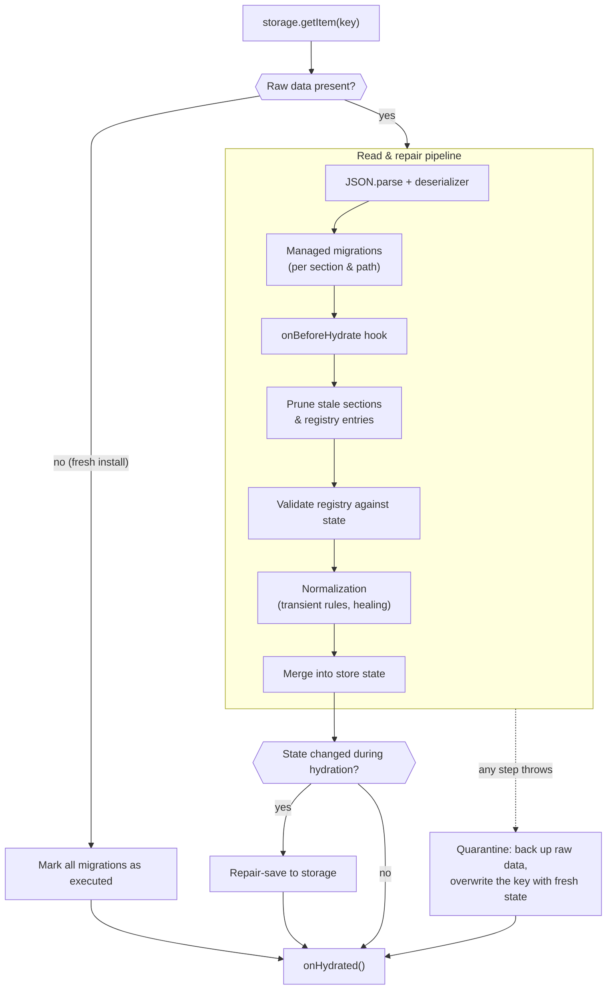

# 🧩 YASM — Yet Another State Management!

> Path-based, purgeable, composable state management for React — built on `useSyncExternalStore` and `immer`.

YASM organizes state as a grid of **Sections × Paths**. A _section_ defines the shape and update logic of a piece of state (like a mini-reducer), and a _path_ is a string address for one **instance** of that section. This makes YASM ideal for applications that open many instances of the same UI simultaneously—like an ERP with dozens of tabs, tables, and dialogs—and lets you **purge** everything under a path when a tab closes.

---

## ✨ Features

- 🗂️ **Multi-instance state**: The same section can live at unlimited paths. `useYasmState('UserTable', '/tabs/1/users')` and `useYasmState('UserTable', '/tabs/2/users')` are fully independent.
- 🧹 **Purgeable state**: Free all state under a path prefix in one call: `purge('/tabs/1')`. Segment-aware matching guarantees `/tabs/1` never touches `/tabs/10`.
- 🧬 **Composable sections**: `arraySectionGenerator` and `objectSectionGenerator` build parent sections whose children are addressable through **path routing**: `useYasmState('Row', '/table[3]')` reads/writes the row _inside_ the table state immutably, with parent subscribers notified.
- ⚡ **Precise re-renders**: Components subscribe per `(section, path)` and can narrow further with selectors. No top-down re-render cascades.
- 📡 **Selector-aware subscriptions**: `store.subscribe(name, path, selector, listener, options?)` evaluates a selector on every update and invokes the listener only when the selection *actually changed* (`'shallow'` by default, `'strict'`, or a custom comparator) — the listener never receives raw `undefined` for a valid section.
- 🔗 **Multi-path subscriptions**: `store.subscribeMany(targets, listener, options?)` watches many `(section, path)` addresses with **one** listener and **one** unsubscribe, batching everything that changed in the same flush into a single, fully-typed `changes` array.
- 🛡️ **Observable hydration**: `useHydration()` (or `store.subscribeHydration()`) tracks `'idle' → 'hydrating' → 'hydrated' | 'quarantined' | 'failed'` so splash screens need no `useEffect` + `.finally(...)` boilerplate.
- 🪝 **Quarantine callback**: `persist.onQuarantine` reports corrupted payloads (with the backup key and error) to error-tracking services — isolated, so it can never block the quarantine reset.
- ↩️ **Optimistic rollback**: `store.captureRollback(name, path)` / `store.captureRollback(pathPrefix)` snapshot state and restore it on API rejection — idempotent, purge-safe, and a no-op when nothing changed.
- ✍️ **Reducer-like updaters with Immer**: Write mutable code, get immutable updates. Updaters returning an unchanged state produce **no** notification churn (reference equality is preserved).
- 🦥 **Lazy initialization**: State is created on first use, optionally with `overrideInitialState` (object or function form).
- 🎯 **Payload creators**: `updater(state => payload)` reads the latest state at dispatch time, avoiding stale closures.
- 🧰 **Zero setup**: `createStore(sectionMap)` + one context provider. No actions, no dispatch strings, no boilerplate.
- 🛡️ **Safe async updates**: Updaters fired after a purge (from `setTimeout`, promises, or stale handlers) are silent no-ops instead of crashes.
- 🩺 **Dev diagnostics**: Helpful errors for unknown sections or missing providers, warnings when purging state that still has mounted subscribers, and opt-in state logging.
- 💾 **Built-in persistence**: Hydrate and save through any sync or async key-value storage, with debounced autosave, section omission, lifecycle hooks, deep normalization, and custom serialization.

---

## 📦 Installation

```bash
npm install @mrnafisia/yasm
# react >= 18.2 is a peer dependency (immer is included automatically)
```

---

## 🚀 Quick Start

```tsx
import {
    createStore,
    YasmContext,
    useYasmState,
    usePurgeYasmState,
    mergeUpdaterGenerator,
    type Section
} from '@mrnafisia/yasm';

// 1. Define sections
type CounterState = { count: number; label: string };
const counterSection: Section<CounterState, Partial<CounterState>> = {
    initialState: { count: 0, label: '' },
    updater: mergeUpdaterGenerator<CounterState>()
};

// 2. Create the store (once, outside components)
const store = createStore({ Counter: counterSection });

// 3. Provide it
const App = () => (
    <YasmContext.Provider value={store}>
        <Counter path="/tabs/1/counter" />
        <Counter path="/tabs/2/counter" />
    </YasmContext.Provider>
);

// 4. Use it — each path is an independent instance
const Counter = ({ path }: { path: string }) => {
    const [count, update] = useYasmState('Counter', path, s => s.count);
    return (
        <button onClick={() => update(s => ({ count: s.count + 1 }))}>
            {count}
        </button>
    );
};
```

💡 In real applications you will usually wrap `useYasmState` in a strongly-typed app hook so that section names, states, and payloads are fully typed — see **💎 TypeScript: Strongly Typed Hooks** below.

---

## 💎 TypeScript: Strongly Typed Hooks

The Quick Start calls `useYasmState` directly — perfectly fine for demos. In a real app, however, TypeScript **cannot infer your section types** from the call site. The reason is simple: the hook never receives your section map. Your store is created _outside_ the component tree (in `store.ts`), and the hook only receives loose `string` arguments, so the generics fall back to their wide defaults — section names are plain strings and the state is untyped.

The industry-standard solution is a **typed wrapper hook**: create your store once, derive its `SectionMap` type, and re-export a thin `useAppState` hook bound to it.

Why the one-time setup is worth it:

- 🧠 **Full inference** — state, selector results, updater payloads, and `overrideInitialState` are precisely typed per section.
- ✍️ **Autocomplete & typo safety** — section names autocomplete in the IDE; a typo like `'Couter'` becomes a compile-time error instead of a runtime surprise.
- 🧩 **One source of truth** — the wrapper is the single place where your app's store type enters the React layer.

Create the wrapper next to your store definition (e.g. `src/store/hooks.ts`):

```ts
import { useYasmState } from '@mrnafisia/yasm';
import { store } from './index';

// 1. Derive the section map type from the initialized store
type SectionMap = typeof store.sectionMap;

type Updater<Name extends keyof SectionMap> = (
    payload:
        | Parameters<SectionMap[Name]['updater']>[1]
        | ((
              state: SectionMap[Name]['initialState']
          ) => Parameters<SectionMap[Name]['updater']>[1])
) => void;

type OverrideInitialState<Name extends keyof SectionMap> =
    | Partial<SectionMap[Name]['initialState']>
    | ((
          initialState: SectionMap[Name]['initialState']
      ) => Partial<SectionMap[Name]['initialState']>);

// 2. Overload 1: basic use (no selector) or use with a selector
function useAppState<Name extends keyof SectionMap, State>(
    name: Name,
    path: string,
    selector?: (state: SectionMap[Name]['initialState']) => State
): [
    unknown extends State ? SectionMap[Name]['initialState'] : State,
    Updater<Name>
];

// 3. Overload 2: use with an options object (selector and/or overrideInitialState)
function useAppState<Name extends keyof SectionMap, State>(
    name: Name,
    path: string,
    options: {
        selector?: (state: SectionMap[Name]['initialState']) => State;
        overrideInitialState?: OverrideInitialState<Name>;
    }
): [
    unknown extends State ? SectionMap[Name]['initialState'] : State,
    Updater<Name>
];

// 4. Implementation signature: delegate to useYasmState and retype the result
function useAppState<Name extends keyof SectionMap, State>(
    name: Name,
    path: string,
    thirdParam?:
        | ((state: SectionMap[Name]['initialState']) => State)
        | {
              selector?: (state: SectionMap[Name]['initialState']) => State;
              overrideInitialState?: OverrideInitialState<Name>;
          }
) {
    return useYasmState(
        name,
        path,
        thirdParam as Parameters<typeof useYasmState>[2]
    ) as [
        unknown extends State ? SectionMap[Name]['initialState'] : State,
        Updater<Name>
    ];
}
```

Now replace every `useYasmState` call in your components with `useAppState`:

```ts
const [count, update] = useAppState('Counter', '/tabs/1/counter', s => s.count);
//                                    ^^^^^^^^^ autocompletes
update({ count: 5 }); // ✅ payload fully typed
update({ cont: 5 }); // ❌ compile-time error
```

### Write-Only Access (`useYasmStateUpdater`)

Many components only _dispatch_ — submit buttons, toolbar actions, debounced savers — and never read the state they write to. They should not re-render when that state changes.

YASM ships a hook for exactly this. `useYasmStateUpdater` returns only the updater and **never subscribes** the calling component — the store does not even notify it when the state changes, so it cannot re-render:

```tsx
import { useYasmStateUpdater } from '@mrnafisia/yasm';

const resetCounter = useYasmStateUpdater('Counter', '/tabs/1/counter');

// This button renders once and never re-renders, even if the counter
// updates a thousand times per second:
<button onClick={() => resetCounter({ count: 0 })}>Reset</button>;
```

For fully typed access (autocomplete + typed payloads), forward it through your app's `SectionMap`:

```ts
const useAppStateUpdater = <Name extends keyof SectionMap>(
    name: Name,
    path: string
) => useYasmStateUpdater<SectionMap, Name>(name, path);
```

How it works — and the manual alternative: every component subscribed to a `(section, path)` is notified after each update, and React re-renders it unless the selected value is reference-equal to the previous one. With raw `useYasmState` you can opt out of re-renders by passing the constant selector `() => null` and destructuring only the updater. The component stays subscribed, but React always bails out because the selected `null` never changes:

```ts
const [, update] = useYasmState('Counter', '/tabs/1/counter', () => null);
```

> ⚠️ **Warning**: If you destructure the state anyway (`const [state, update] = useYasmState(...)`), the component subscribes to the full state at that path and re-renders on every change of it — even if `state` is never read. Destructure only the updater (`const [, update] = ...`) or use `useYasmStateUpdater`.

---

## 🧠 Core Concepts

### Mental Model

YASM answers three questions about every piece of state:

| Question                    | Concept     | Example                                   |
| :-------------------------- | :---------- | :---------------------------------------- |
| _What kind_ of state is it? | **Section** | `UserRow` (shape + update logic)          |
| _Which instance_ of it?     | **Path**    | `/tabs/1/users[7]`                        |
| _Where_ does it live?       | **Routing** | Independently, or inside a parent section |

A section is reusable logic; paths give you unlimited instances of it for free; routing optionally nests an instance inside another section's state instead of storing it on its own.

### Sections

A section is `{ initialState, updater, routing?, normalize?, persist? }`. The updater is Immer-powered: mutate the draft **or** return a new state.

```ts
type Todo = { id: number; title: string };
const todoSection: Section<Todo[], { add: Todo }> = {
    initialState: [],
    updater: (state, { add }) => {
        state.push(add); // mutate freely — immer handles immutability
    }
};
```

### Paths

Paths are plain strings, but by convention, they are hierarchical: `/tabs/12/users/table`. Segments are separated by `/`, `[`, or `.`. Purging and routing are **segment-aware**: `/tabs/1` covers `/tabs/1/x` and `/tabs/1[3]` but **not** `/tabs/10`.

The boundary characters default to `'/'`, `'['`, and `'.'` (exported as `DEFAULT_PATH_BOUNDARY_CHARS`). If your paths follow a different convention, customize them when creating the store — purge matching and routing resolution both use the configured set:

```ts
const store = createStore(sectionMap, {
    // extend the defaults, or replace them entirely (e.g. just ['/', '~'])
    pathBoundaryChars: defaultChars => [...defaultChars, '~']
});
```

### 🛣️ Path Conventions: who owns which path?

Paths are hierarchical addresses, so treat them like URLs: **every path must have exactly one owner**. The convention that keeps large apps collision-free:

1. **Own state — use the `path` prop as-is.** When a component creates or reads its _own_ state, pass the received `path` prop unchanged to its hooks:

    ```tsx
    const Child = ({ path }: { path: string }) => {
        // ✅ This component OWNS `path` — use it verbatim:
        const [state, update] = useAppState('ChildSection', path);
        // ...
    };
    ```

2. **Passing downstream — always append a suffix starting with `/`.** Never forward the same path to two different components. Each child gets a dedicated sub-path so every component owns a distinct address:

    ```tsx
    const Parent = ({ path }: { path: string }) => {
        const [state] = useAppState('ParentSection', path); // parent owns `path`

        return (
            <>
                {/* ✅ each child owns a unique sub-path */}
                <GrandChild path={path + '/a'} />
                <OtherChild path={path + '/b'} />
            </>
        );
    };
    ```

**⚠️ Why this matters — path collision is a silent, dangerous bug.** If two components both use the same path as their own, they unknowingly **share one state instance**: writes from one appear in the other, selectors fight each other, and a `purge(path)` intended for one destroys both. Because nothing crashes, this can go unnoticed for a long time. The same discipline also keeps purges precise — a prefix only ever covers subtrees that genuinely belong to it.

Additional hygiene rules:

- 🏷️ **Name suffixes after your UI hierarchy** (`/form`, `/table`, `/manageDialog`), not after implementation details — future-you reads them as a map of the app.
- 🔒 **Keep suffixes deterministic.** Do not embed volatile values (render counters, random ids) in paths passed down — a changing path means the state is lost and recreated on every change.
- 🧹 **Design for purgeability.** Structure paths so that one meaningful prefix (e.g. `/tabs/12`) covers everything a tab owns — closing the tab then frees all of its state with a single call.

### Updaters & Payload Creators

```ts
const [state, update] = useYasmState('Counter', '/c');

update({ count: 5 }); // Payload
update(prev => ({ count: prev.count + 1 })); // Payload creator (reads latest state)
```

YASM also ships updater factories and a setter helper. Both factories return the **same state reference** when nothing actually changes, so no-op updates produce no notifications:

```ts
const counterUpdater = mergeUpdaterGenerator<CounterState>(); // Partial<S> shallow merge
const fieldUpdater = propertyUpdaterGenerator<CounterState>(); // { key, value } payload

// Cached per-field setters with stable references (safe for dependency arrays):
const setCount = getFieldSetter(update, 'count');
setCount(5);
setCount(prev => prev + 1);
```

The setter cache is keyed by the updater function — and YASM keeps the updater reference stable per `(section, path)` — so the same setter reference survives re-renders and remounts, and is safe to use in dependency arrays.

> ⚠️ **Optional Properties, ****`undefined`****, and ****`exactOptionalPropertyTypes`**
>
> YASM's partial-update APIs use optional properties to mean “leave this field unchanged”. TypeScript's default behavior also allows an explicit `undefined` for those properties:
>
> ```ts
> updateState({ age: undefined });
> ```
>
> If `age` is a `number`, this can accidentally overwrite a valid value with `undefined`.
>
> The TypeScript option `exactOptionalPropertyTypes` prevents this:
>
> ```json
> {
>     "compilerOptions": {
>         "exactOptionalPropertyTypes": true
>     }
> }
> ```
>
> However, this option is not part of `strict`, and enabling it globally can be impractical in existing applications because third-party declaration files may rely on the looser optional-property behavior. In particular, large UI libraries can produce many compatibility errors.
>
> For that reason, YASM does not require `exactOptionalPropertyTypes` to be enabled.
>
> #### Recommended state design
>
> When a field can intentionally have “no value”, prefer a required property with an explicit `null` value:
>
> ```ts
> type UserState = {
>     age: number | null;
>     selectedId: string | null;
> };
> ```
>
> rather than:
>
> ```ts
> type UserState = {
>     age?: number;
>     selectedId?: string;
> };
> ```

> or:
>
> ```ts
> type UserState = {
>     age: number | undefined;
>     selectedId: string | undefined;
> };
> ```
>
> This makes the state invariant explicit: the property always exists, and its “empty” value is `null`, never `undefined`.
>
> Do not use `age?: number | null` as a substitute. With `exactOptionalPropertyTypes` disabled, that still permits an explicit `undefined`.
>
> This convention also makes state checks unambiguous:
>
> ```ts
> if (state.age === null) {
>     // no age
> }
> ```
>
> instead of having to account for both `null` and `undefined`.
>
> #### Important limitation
>
> Using `null` does not completely replace `exactOptionalPropertyTypes`.
>
> YASM's partial payloads still intentionally use optional properties:
>
> ```ts
> updateState({ age: 42 });
> updateState({ selectedId: null });
> ```
>
> When `exactOptionalPropertyTypes` is disabled, TypeScript can still allow:
>
> ```ts
> updateState({ age: undefined });
> ```
>
> even when the underlying state is:
>
> ```ts
> type UserState = {
>     age: number | null;
> };
> ```
>
> Therefore:
>
> * Prefer required `T | null` properties in YASM state when “no value” is meaningful.
> * Avoid using `undefined` as a valid state value unless it is explicitly part of the state model.
> * Do not rely on `null` alone as a complete replacement for `exactOptionalPropertyTypes`.
> * If your project can safely enable `exactOptionalPropertyTypes`, it remains the strongest compile-time protection for YASM's optional/partial APIs.
>
> When `undefined` can enter state through external data, migrations, persistence, or other untyped boundaries, normalize or validate that data before it becomes application state.

---

### Reducer-Style Sections (Action / Command Pattern)

While utility generators like `mergeUpdaterGenerator` provide convenient shallow merging, YASM section updaters are fundamentally mini-reducers powered by Immer. You are not limited to object payloads—a section updater can accept any structured action or command, matching the familiar `useReducer` or Redux Toolkit pattern:

```ts
type CounterState = {
    count: number;
    step: number;
};

type CounterAction =
    | { type: 'INCREMENT' }
    | { type: 'DECREMENT' }
    | { type: 'SET_STEP'; step: number }
    | { type: 'RESET' };

const counterSection: Section<CounterState, CounterAction> = {
    initialState: { count: 0, step: 1 },
    updater: (draft, action) => {
        switch (action.type) {
            case 'INCREMENT':
                draft.count += draft.step;
                break;
            case 'DECREMENT':
                draft.count -= draft.step;
                break;
            case 'SET_STEP':
                draft.step = action.step;
                break;
            case 'RESET':
                draft.count = 0;
                draft.step = 1;
                break;
        }
    }
};

```

Using it inside components via `useYasmState` or `useYasmStateUpdater` remains completely identical:

```tsx
const [state, dispatch] = useYasmState('Counter', '/tabs/1/counter');

// Dispatching actions:
dispatch({ type: 'INCREMENT' });
dispatch({ type: 'SET_STEP', step: 5 });

// Optimistic Rollback (store.captureRollback) also restores this cleanly 
// without relying on or clobbering your action types.
```

---

### Selectors & Overrides

```ts
const [label] = useYasmState('Counter', '/c', s => s.label);

const [state, update] = useYasmState('Counter', '/c', {
    selector: s => s,
    overrideInitialState: { count: 100 } // Used only on first initialization
});
```

> ⚠️ **Warning**: Selectors must return **stable** values for unchanged state (primitives, or references stored in state). A selector that builds a new object/array on every call will cause infinite re-renders under `useSyncExternalStore`.

### Selector-Aware Subscriptions (`store.subscribe`)

The low-level `store.subscribe(callback, name, path)` remains fully supported (it backs `useSyncExternalStore`). On top of it, YASM offers a **selector-aware overload** for imperative listeners outside React:

```ts
store.subscribe(
    'UserRow',
    '/users[7]',
    row => row.name, // evaluate the same way a hook selector would
    (name, prevName) => console.info(`${prevName} → ${name}`),
    { equality: 'shallow', fireImmediately: false }
);
```

- The selector is evaluated whenever `(name, path)` is notified (update or purge), memoized, and re-fired **only when the selection actually changed**:
  - `'shallow'` (default) — `Object.is`, falling back to a top-level key-by-key comparison. A selector that rebuilds its result object on every call does **not** re-fire when every top-level value is unchanged.
  - `'strict'` — `Object.is` only (a fresh object identity always re-fires).
  - custom — `(prev, next) => boolean`, giving you full control (e.g. compare a **parity** or a sorted key instead of the raw value).
- **No raw `undefined`**: lazily-uninitialized or purged paths are evaluated against the section's `initialState`, never a raw `undefined` for a valid section. Routed children that vanished resolve to their last-known value (same convention as the hooks).
- `fireImmediately: true` invokes the listener once at subscription time with `(currentSelected, undefined)`.
- Listener exceptions are **isolated** (logged, never propagated) — a throwing listener cannot break the store dispatch or other subscribers.
- Returns an `unsubscribe` function that removes the registration cleanly.

> 💡 Use this for table-cell observers, analytics, cross-component coordination, or imperative code outside the React tree. Inside React, `useYasmState` with a selector is still the ergonomic choice — it wraps the exact same subscription machinery.

---

## 🧬 Composition & Routing

Composition lets one section store its state **inside another section**. The parent owns the single copy of the data; child hooks address slices of it through **path routing**. One source of truth, two views: `useYasmState('UserTable', '/users')` sees the whole table, while `useYasmState('UserRow', '/users[7]')` reads and writes row 7 _inside_ that same table state — immutably, with the parent's subscribers notified.

Both the parent and every child must be registered in `createStore`: the child section defines the shape and updater of its slice, and the composed parent defines how slices are addressed.

> ⚠️ **Strict bracket syntax**: the built-in generators address children with `[id]` / `[key]` segments. `/users/7` is **not** the same as `/users[7]` — it matches the parent prefix but then fails routing with an "invalid ArraySection path" error when read. Only bracket segments select into composed sections.

### ArraySection

```ts
const store = createStore({
    UserTable: arraySectionGenerator('UserRow', userRowSection),
    UserRow: userRowSection
});

// Parent: the whole table
const [table, updateTable] = useYasmState('UserTable', '/users');
updateTable({
    addingItems: [{ id: 7, partialState: { name: 'Sara' } }],
    order: [7]
});

// Child: one row, addressed *through* the parent
const [row, updateRow] = useYasmState('UserRow', '/users[7]');
updateRow({ name: 'Sara A.' }); // Immutably updates the row inside the table
```

The parent state is an ordered map: `{ order: number[]; map: Record<number, S> }` — `order` holds row ids in display order, `map` holds the row states keyed by id. So `table.map[7]` is exactly what `row` reads through the child hook.

> ⚠️ **IDs are not array indexes**: `[7]` means the row with **id 7** (the key in `map`), not the seventh row. `order` alone controls display/iteration order; `map` is the lookup. With `order: [20, 5, 100]`, the second rendered row is `/users[5]` (`map[5]`) — even though it sits at index 1.

The `updater` payload supports `order`, `addingItems`, `editingItems`, and `removingIDs`. These are applied in the order: **order → removals → additions → edits**, allowing you to add and edit the same item in a single update.

- `addingItems` merges each `partialState` over the child section's `initialState`.
- `editingItems` runs the child section's own updater on the row; an id missing from `map` is skipped with a development warning.
- `removingIDs` deletes rows from `map` only — keeping `order` in sync is your responsibility. A stale id in `order` points at a removed row and throws a "has not been initialized" error when routed to.

### ObjectSection

```ts
const profileState = { firstName: '', lastName: '' };
const addressState = { city: '', street: '' };
const profileUpdater = mergeUpdaterGenerator<typeof profileState>();
const addressUpdater = mergeUpdaterGenerator<typeof addressState>();

// The composed parent: each entry maps a local key to a registered child section
const formSection = objectSectionGenerator({
    profile: { name: 'Profile', state: profileState, updater: profileUpdater },
    address: { name: 'Address', state: addressState, updater: addressUpdater }
});

const store = createStore({
    Form: formSection,
    // ⚠️ Children must be registered too, under the same names used above —
    // otherwise YASM logs 'there is no "X" section to have a route on!'
    Profile: { initialState: profileState, updater: profileUpdater },
    Address: { initialState: addressState, updater: addressUpdater }
});

// Parent: the whole form
const [form, updateForm] = useYasmState('Form', '/form');
updateForm({ profile: { firstName: 'Sara' } });

// Child: one field group, addressed through the parent
const [profile, updateProfile] = useYasmState('Profile', '/form[profile]');
updateProfile({ lastName: 'A.' });
```

ObjectSection is not an object-merge helper — it creates **routing boundaries**. Each child keeps owning its own state shape and updater; the parent only owns placement (where the child lives inside its state).

### Deep / Nested Composition

Routers compose recursively: a composed child can itself be a composed parent. A table of rows, where each row is a form:

```ts
const rowForm = objectSectionGenerator({
    profile: { name: 'Profile', state: profileState, updater: profileUpdater },
    settings: {
        name: 'Settings',
        state: settingsState,
        updater: settingsUpdater
    }
});

const store = createStore({
    Table: arraySectionGenerator('Row', rowForm),
    Row: rowForm, // the composed row doubles as ArraySection child and routing parent
    Profile: { initialState: profileState, updater: profileUpdater },
    Settings: { initialState: settingsState, updater: settingsUpdater }
});

useYasmState('Table', '/table'); // the whole table
useYasmState('Row', '/table[5]'); // row 5 (the whole form)
useYasmState('Profile', '/table[5][profile]'); // just the profile of row 5
```

The path query is evaluated level by level — `[5]` selects the row inside the table, then the remaining `[profile]` is handed to the row's own routing. Note that each intermediate level must be in use first (its path is registered when a hook at that path initializes), following the parent-first rule below.

### How Routing Works

- **Registration**: when a parent path (e.g. `/users`) is first used, YASM records it in an internal `pathRegistry`. A child hook like `useYasmState('UserRow', '/users[7]')` resolves its parent by segment-aware matching against registered paths, then applies the parent's router: `[7]` selects row 7 from the table state. Any remaining path continues through deeper registered routing, so **multi-level composition works** — a row can itself be a composed section with its own children.
- **Initialize the parent first**: the registry entry is created when the parent path is initialized. If a child path is used before its parent path exists (fresh session, parent not yet mounted), routing cannot resolve and YASM falls back to storing that child's state directly. After hydration the registry is restored from persistence, so children route correctly even before the parent component mounts — this is exactly why YASM persists `pathRegistry`.
- **Notifications**: a child update produces a new parent state immutably, so subscribers of the parent path are notified (the table view re-renders). Child hooks use their own selectors, which keeps their re-renders precise — a row only re-renders when its selected slice actually changed.
- **Custom routers**: the `routing` field of a section accepts a `Router` (`selectByPathQuery` / `updateByPathQuery`) per child name, so you can build your own composition shapes. You rarely need to — the two generators cover the common cases.

> ⚠️ **Warning**: Registered routing paths must not be nested within each other. YASM logs an error in development if a path is a segment-prefix of another registered path of a routing section.

### Custom Routers

If brackets don't fit your mental model — or you need a different data structure, like a plain dictionary — define the `routing` field yourself. A `Router` provides `selectByPathQuery` (resolve the child state from the remaining path) and `updateByPathQuery` (apply the child's new state immutably into the parent). Here is a dictionary router using dot-notation (`.key`) instead of brackets:

```ts
const dictionarySection: Section<
    Record<string, ChildState>,
    Record<string, Partial<ChildState>>
> = {
    initialState: {},
    updater: (state, payload) => {
        for (const key in payload) {
            state[key] = { ...state[key], ...payload[key] };
        }
    },
    routing: {
        // The key must match the child's registered section name
        Child: {
            // pathQuery is the part after the registered parent path,
            // e.g. '.user1' for useYasmState('Child', '/dict.user1')
            selectByPathQuery: (state, pathQuery) => {
                const key = pathQuery.slice(1); // strip the leading '.'
                if (state[key] === undefined) {
                    throw new Error(`YASM: unknown dictionary key "${key}".`);
                }
                return [state[key], '']; // child state + unused remainder
            },
            updateByPathQuery: (state, pathQuery, getChildState) => {
                const key = pathQuery.slice(1);
                const newChild = getChildState(state[key], '');

                // 🔒 No-op bailout: an unchanged child keeps the parent reference
                if (newChild === state[key]) {
                    return state;
                }

                return { ...state, [key]: newChild };
            }
        }
    }
};
```

Since `.` is one of the default boundary characters, `/dict.user1` segment-matches the registered parent path `/dict` and routes through the custom router — the same mechanics the generators use, just a different query syntax.

---

## 🧹 Purging

```tsx
const purge = usePurgeYasmState();

// When tab 12 closes:
purge('/tabs/12'); // Removes state, subscribers, memo records & path registrations
```

- Matching is **segment-aware** by default. Pass `{ match: 'startsWith' }` for legacy raw-prefix behavior.
- Purge **after** the components using that state have unmounted (e.g., from a `useEffect` with a `setTimeout` at the app root). In development, YASM warns _at purge time_ if subscribers are still attached, specifying the exact section and path. Or skip the timing problem entirely with [`purgeWhenUnused`](#-purging-without-racing-react-purgewhenunused) below.
- Purging is idempotent and never throws for unknown/already-purged paths or stale sections restored from persistence.
- Outside React (tests, event buses), use the pure function: `purgeYasmState(store, '/tabs/12')`.

### ⏳ Purging Without Racing React: `purgeWhenUnused`

> ⚠️ **The premature-purge problem**: raw `purge(path)` destroys state **now**. React unmounts components _asynchronously_ — a `purge()` inside the same click handler that removes a tab fires **before** React has unmounted anything. Matching paths still have live subscribers, YASM warns, and those components re-initialize their state on the next render — visible UI resets. You cannot call raw `purge()` wherever you like; it is fire-_now_ semantics for when you truly need immediate destruction (e.g., sensitive data).

`store.purgeWhenUnused(pathPrefix)` — or the `usePurgeWhenUnused()` hook — is the lifecycle-safe counterpart. It separates **who decides** from **when it happens**: _you_ decide the subtree's state is dead by calling it; _the library_ destroys it at the first safe moment — the instant the **last subscriber** of every matching path unsubscribes, or **immediately** when nothing is subscribed at call time.

```tsx
import { usePurgeWhenUnused } from '@mrnafisia/yasm';

const purgeWhenUnused = usePurgeWhenUnused();

// Closing tab 12 — fires right after the tab's components unmount,
// with no queue, no setTimeout, and no app-level orchestration:
purgeWhenUnused('/tabs/12');

// Several subtrees at once — each prefix is scheduled independently:
purgeWhenUnused(['/tabs/12', '/dialogs/42', '/drafts/7']);

// A dialog that must forget its state on close — fires once the dialog's
// children unsubscribe (after the close animation):
purgeWhenUnused(`${dialogPath}`);
```

- ✅ **Unmounting alone never purges.** Switching tabs or paginating rows keeps state alive (that is the whole point of YASM) — a purge happens only where _you_ asked for one.
- 🔒 **Fire-time re-verification**: at the moment of firing, YASM re-checks **live subscribers**. Paths that were **revived** (a deleted row restored by a refetch) or **newly created with mounted readers** under the prefix are never wiped — the purge re-arms and keeps waiting.
- ⚠️ **Detection is subscription-based**: the re-verification sees components that _read_ the state. A path recreated between scheduling and firing purely through write-only hooks (`useYasmStateUpdater`, which never subscribes) is invisible to it and is destroyed together with the rest of the prefix. In practice cells and forms read their state, so this only matters for exotic write-only-only subtrees.
- 💾 **Refresh-safe**: pending purges are persisted in snapshot `metadata.pendingPurges` and re-scheduled during the next hydration. The marker stays present during the whole deferred window — a synchronous `save()` inside that window persists the marker together with the still-existing state. At timeout execution the live subscribers are checked again: if the state was revived, the purge remains pending; if there are still no subscribers, the marker is removed and the state is purged. Since consumers are not mounted yet, hydrated markers execute immediately at hydrate time — a refresh in the middle of a pending window can never leave orphaned state behind, and a snapshot taken before a purge could fire self-heals on the next boot.
- 🚫 **No dev warnings** on this path — the warning stays exclusive to raw `purge()`, where it catches real lifecycle bugs.

#### 🧭 Who decides? When does it happen? Choosing between the two purge APIs

Every purge in YASM answers two separate questions:

1. **Who decides the state is dead?** — always **you**, the application. YASM never destroys state on its own initiative: unmounting a component, switching tabs, or paginating rows never purges anything by itself. This is what makes state survive tab switches and page refreshes.
2. **When is it actually destroyed?** — this is the only difference between the two APIs:

|                                                       | `usePurgeYasmState()` → raw `purge(path)`                        | `usePurgeWhenUnused()` → safe `purgeWhenUnused(path)`                                                         |
| :---------------------------------------------------- | :--------------------------------------------------------------- | :------------------------------------------------------------------------------------------------------------ |
| **Timing**                                            | 🔥 Fire **now**, synchronously                                   | ⏳ Fire at the **first safe moment**: when the last matching subscriber unsubscribes (or immediately if none) |
| **Safe inside a click handler that unmounts things?** | ❌ No — React has not unmounted yet → dev warning + UI resets    | ✅ Yes — by design                                                                                            |
| **Revived paths** (row restored by a refetch)         | ❌ Wiped                                                         | ✅ Re-verified at fire time; live readers block the fire                                                      |
| **Refresh during the pending window**                 | —                                                                | ✅ Pending purges are persisted and drained on next hydration                                                 |
| **Dev warning**                                       | ✅ Warns when subscribers are still attached (catches real bugs) | 🚫 Never warns                                                                                                |

**💡 Rule of thumb: prefer `purgeWhenUnused`.** Use raw `purge` only when _immediacy itself_ is the requirement:

- 🔒 Wiping sensitive data on logout (must not survive even one more tick).
- 🧪 Tests and non-React code where you have already guaranteed nothing is subscribed.
- Mode switches where you know the old form's components unmount in the same commit and you want destruction scheduled for exactly that moment.

A common pattern that works with both — **mode-switching forms** (`view` / `add` / `edit`): keep each mode's fields under a per-mode sub-path (`${path}/${mode.action}/...`), then purge the previous mode's subtree when switching. With `purgeWhenUnused` the old form's cells are destroyed right after they unsubscribe from the switch commit — no queue, no timers:

```tsx
const _path = path + `/${mode.action}`; // per-mode subtree: .../view, .../edit, ...

const changeMode = (nextMode: Mode) => {
    updateState({ mode: nextMode }); // old mode's components unmount in this commit
    purgeWhenUnused(_path); // library fires once they have unsubscribed
};
```

> ⚠️ One caveat to keep in mind: fire-time re-verification detects paths with mounted **readers**. A path recreated purely through write-only hooks (`useYasmStateUpdater`, which never subscribes) between scheduling and firing is invisible to it and is destroyed together with the prefix. Cells and forms read their state, so this only matters for exotic write-only-only subtrees.

#### Recipe: freeing per-row state when rows leave the data

Rows typically keep state at `${basePath}/${rowID}/...`. Derive purges from **data** (the id list), never from component lifecycle — pagination unmounts rows whose state must survive. A minimal reconciliation hook (a production-grade version ships in [`examples/usePurgeRemovedRows.ts`](./examples/usePurgeRemovedRows.ts)):

```tsx
const usePurgeRemovedRows = (
    basePath: string,
    ids: readonly (number | string | bigint)[]
) => {
    const purgeWhenUnused = usePurgeWhenUnused();

    const trackedRef = useRef<{
        basePath: string;
        ids: ReadonlySet<string>;
    } | null>(null);

    const currentIDs = new Set(ids.map(String));

    useEffect(() => {
        const tracked = trackedRef.current;
        trackedRef.current = { basePath, ids: currentIDs };

        // 🛡️ Never diff ids across different subtrees
        if (tracked === null || tracked.basePath !== basePath) {
            return;
        }

        tracked.ids.forEach(id => {
            if (!currentIDs.has(id)) {
                // This row's state is dead — the library frees it at the
                // first safe moment and never wipes a restored row.
                purgeWhenUnused(`${basePath}/${id}`);
            }
        });
    });
};

// Usage — covers single delete, bulk delete, and wholesale refetch
// replacement in one line:
usePurgeRemovedRows(
    path,
    dataSource.map(r => r.id)
);
```

---

## 🔗 Watching Several Paths at Once (`subscribeMany`)

Outside React you often need to mirror a handful of unrelated store addresses into some non-React sink (a theme object, an HTTP client, an analytics bridge). With `store.subscribe` that means one call — and one variable to track — per address:

```ts
const unsubBase = store.subscribe(() => { /* … */ }, 'BaseInfo', '/baseInfo');
const unsubCred = store.subscribe(() => { /* … */ }, 'Credential', '/credential');

// Teardown has to track both handles separately:
unsubBase();
unsubCred();
```

`store.subscribeMany` collapses that into one subscription with one teardown:

```ts
const unsubscribeAll = store.subscribeMany(
    [
        { name: 'BaseInfo', path: '/baseInfo' },
        { name: 'Credential', path: '/credential' }
    ],
    changes => {
        for (const change of changes) {
            if (change.name === 'BaseInfo') {
                // ✅ change.current is narrowed to BaseInfo's state — no cast
                ManualStore.theme = change.current.theme;
                ManualStore.token = change.current.token;
            }

            if (change.name === 'Credential') {
                // ✅ narrowed to Credential's state
                ManualStore.userUUID = change.current.uuid;
            }
        }
    },
    { fireImmediately: true }
);

// One call tears every address down:
unsubscribeAll();
```

Each entry of `changes` is `{ name, path, current, previous }`. The array is a **discriminated union on `name`**, so narrowing on it also narrows `current` and `previous` to that section's state type.

### Batching

| `options.batch` | Behavior |
| :--- | :--- |
| `'microtask'` (default) | Every change from the same synchronous flush is coalesced into **one** listener call on the next microtask, with at most one entry per address (newest value wins). An address that changes and changes back inside that flush is dropped. |
| `'sync'` | The listener runs inline, inside the dispatch that produced the change, with a single-entry batch. |

Microtask batching is what makes the post-hydration notification pass arrive as a single call instead of one per path.

### Guarantees

- **Never `undefined`** — a lazily-uninitialized, purged, or unresolvable routed address is read as the section's `initialState`. Subscribing lazily initializes direct addresses, exactly like a hook would.
- **Routed children** subscribe on their physical parent path, so a row at `/table[5]` is notified when its parent table updates.
- **Isolated** — a throwing listener is logged and never aborts other subscribers, never breaks the store dispatch, and never reaches the hydration error boundary.
- **Deduplicated** — repeating the same `(name, path)` target wires it once.
- **Idempotent teardown** — calling the returned function twice is harmless.
- `fireImmediately: true` invokes the listener once **synchronously** at subscription time with one entry per target and `previous: undefined`.

> ⚠️ These are real subscriptions. The watched paths count as "in use", so a `purgeWhenUnused` over a matching prefix will wait until you unsubscribe.

---

## ↩️ Optimistic Rollback (`captureRollback`)

Optimistic UI updates mutate the store **before** the API call settles. When the call rejects, you need the exact pre-mutation state back. `store.captureRollback` removes the manual bookkeeping:

```ts
// 1. Snapshot the row(s) BEFORE the optimistic update
const rollback = store.captureRollback('UserRow', '/users[7]');

// 2. Apply the optimistic patch
updateRow(path, { saving: true });
await saveRowRemote({ ... });

// 3. On rejection — restore in one call:
try {
    await saveRowRemote({ ... });
} catch (error) {
    rollback(); // row is back to its exact captured value
}
```

Two overloads:

| Call                                              | Captures                                                        |
| :------------------------------------------------ | :-------------------------------------------------------------- |
| `captureRollback(name, path)`                     | The value at that path, resolved through routing (`ArraySection`/`ObjectSection` children included). |
| `captureRollback(pathPrefix)`                     | Every state entry matching the segment-aware prefix (same semantics as `snapshotByPrefix`).         |

Guarantees:

- **Immutable snapshot** — the captured values are the store's own (frozen in dev) references; capturing never mutates anything.
- **No-op when unchanged** — rolling back over state that did not change fires **zero** notifications and schedules **no** autosave (reference-equality fast path).
- **Purge-safe** — paths destroyed after capture are silently skipped, never resurrected, and never throw.
- **Idempotent** — calling `rollback()` repeatedly is harmless; the second call is a pure no-op.
- **Notifies** — real restores trigger the same change fan-out as any update (`onStateChange`, autosave, per-path subscribers).

---

## 📋 Subtree Cloning (`store.cloneSubtree` & `useCloneYasmSubtree`)

In multi-instance workspace applications (such as ERPs, CMS platforms, or multi-tab desktops), users frequently want to duplicate an entire tab or modal—similar to **"Duplicate Tab" in Google Chrome**.

Because a tab often contains dozens of nested tables, forms, and cell states (e.g. `PriceManage`, `PriceFormTable`, `PriceTypeCell`, `NumberCell`), manually reading and re-dispatching each state slice is error-prone and breaks routing.

`store.cloneSubtree(sourcePrefix, targetPrefix, options?)` (or the `useCloneYasmSubtree()` hook) performs a deep, decoupled duplication of an entire path subtree:

```tsx
import { useCloneYasmSubtree } from '@mrnafisia/yasm';

const cloneSubtree = useCloneYasmSubtree();

// Duplicate Tab 1 to Tab 2:
const handleDuplicateTab = () => {
    cloneSubtree('/tabs/1', '/tabs/2', {
        // Optional: omit temporary dialogs or transient view state
        omitSections: ['Dialog', 'ManageDialog'],
        // Optional: transform cloned values before writing
        transform: (sectionName, state, sourcePath, targetPath) => {
            if (sectionName === 'PriceManage') {
                return { ...state, title: `${state.title} (Copy)` };
            }
            return state;
        }
    });
};
```

### Core Guarantees & Features:

1. **Deep Independence**:
Values are deeply cloned and are independent from the source. With the default serializer/deserializer, native structured-clone-supported values such as `BigInt`, `Date`, `Map`, `Set`, and `RegExp` remain their original value types. Custom application-specific classes such as `Decimal` require a serializer/deserializer pair that preserves their type. If a value cannot be cloned by the configured serializer/deserializer or by `structuredClone`, `cloneSubtree` throws before mutating the store. Modifying values in the duplicated tab will never mutate or leak into the original tab.
2. **Composed Section Routing Support**:
When using `arraySectionGenerator` or `objectSectionGenerator`, parent paths are registered inside `store.pathRegistry`. `cloneSubtree` automatically duplicates matching `pathRegistry` records to the new prefix. Composed child hooks (e.g., `useYasmState('Row', '/tabs/2/table[5]')`) will immediately resolve through their parent table without falling back to unrouted direct storage.
3. **Segment-Aware Path Matching**:
Like `purgeYasmState`, matching is segment-aware by default. Cloning `'/tabs/1'` to `'/tabs/2'` will clone `'/tabs/1/form'` and `'/tabs/1[5]'`, but will **never** accidentally hijack sibling paths like `'/tabs/10'`. Asymmetric trailing slashes (e.g., `'/tabs/1/'` vs `'/tabs/2'`) are automatically normalized.
4. **Persistence & Change Notification**:
Cloning triggers internal change notifications (`store[SYMBOL_NOTIFY_CHANGE]()`), scheduling debounced persistence auto-saves and alerting `onStateChange` listeners.
5. **Purge Compatibility**:
Because all cloned state instances and routing paths reside cleanly under `targetPrefix`, closing the duplicated tab and calling `purgeWhenUnused(targetPrefix)` cleanly wipes all duplicate state without leaving orphaned memory.

### Options

| Option | Type | Description | Default |
| --- | --- | --- | --- |
| `match` | `'segment' \| 'startsWith'` | How `sourcePrefix` is matched against stored paths. | `'segment'` |
| `omitSections` | `(keyof SM)[]` | Sections to exclude from the cloning process. | `[]` |
| `transform` | `(sectionName, state, sourcePath, targetPath) => unknown` | Hook to mutate or sanitize state before insertion at `targetPath`. | `undefined` |

### Complete Tab Duplication Example

```tsx
import { useCloneYasmSubtree } from '@mrnafisia/yasm';

type Tab = { id: string; title: string; path: string };

const TabsBar = () => {
    const cloneSubtree = useCloneYasmSubtree();
    const [tabs, setTabs] = useState<Tab[]>([
        { id: '1', title: 'Invoice #101', path: '/tabs/1' }
    ]);
    const [activeTabId, setActiveTabId] = useState('1');

    const duplicateTab = (sourceTab: Tab) => {
        const nextId = String(Date.now());
        const targetPath = `/tabs/${nextId}`;

        // 1. Deep clone all YASM state and routing from the source tab
        cloneSubtree(sourceTab.path, targetPath, {
            omitSections: ['Dialog'], // Don't copy open modal dialogs
            transform: (sectionName, state) => {
                if (sectionName === 'InvoiceForm') {
                    // Reset invoice number or status if required
                    return { ...state, isDraft: true };
                }
                return state;
            }
        });

        // 2. Add the cloned tab to UI state and focus it
        const newTab: Tab = {
            id: nextId,
            title: `${sourceTab.title} (Copy)`,
            path: targetPath
        };

        setTabs(prev => [...prev, newTab]);
        setActiveTabId(nextId);
    };

    return (
        <div>
            {tabs.map(tab => (
                <div key={tab.id} onContextMenu={() => duplicateTab(tab)}>
                    {tab.title}
                </div>
            ))}
        </div>
    );
};
```

---

## 💾 Persistence

Persistence is configured in the second argument to `createStore`. YASM saves `store.state`, `store.pathRegistry`, and a small `metadata` record (used for migration bookkeeping). The registry is required to restore composition/routing correctly.

The full hydration pipeline, in execution order:



The storage adapter may be synchronous or asynchronous and must provide the following shape:

```ts
type YasmPersistenceAdapter = {
    getItem(key: string): string | null | Promise<string | null>;
    setItem(key: string, value: string): void | Promise<void>;
    removeItem(key: string): void | Promise<void>;
    clear?(): void | Promise<void>;
};
```

### Browser Example with `localStorage`

```tsx
import { ReactNode, useEffect, useState } from 'react';
import { createStore, YasmContext } from '@mrnafisia/yasm';

const store = createStore(
    {
        BaseInfo: baseInfoSection,
        UserTable: userTableSection,
        UserManage: userManageSection
    },
    {
        persist: {
            key: 'my-app:yasm-state',
            storage: window.localStorage,

            // Do not persist permissions, tokens, temporary UI, etc.
            omitSections: ['BaseInfo'],

            // Save after YASM updates and purges, debounced by 1.5 seconds.
            autoSave: true,
            persistDebounceMS: 1500,

            onHydrated: () => {
                console.info('YASM state restored');
            }
        }
    }
);

export const StoreProvider = ({ children }: { children: ReactNode }) => {
    const [ready, setReady] = useState(false);

    useEffect(() => {
        let cancelled = false;

        store
            .hydrate()
            // hydrate() only rejects when even the repair-save could not write
            // storage (status lands on 'failed'). Handle it so it does not
            // become an unhandled promise rejection.
            .catch(error => console.error('YASM hydration failed:', error))
            .finally(() => {
                if (!cancelled) setReady(true);
            });

        return () => {
            cancelled = true;
        };
    }, []);

    return (
        <YasmContext.Provider value={store}>
            {/* Critical: do not mount any useYasmState consumers before hydration finishes */}
            {ready ? children : null}
        </YasmContext.Provider>
    );
};
```

> ⚠️ **Race Condition Warning**
> Call `store.hydrate()` **once** during application startup **and before mounting any component that calls `useYasmState`**.
> Mounting consumers first will not lose data anymore — when hydration lands, a notification pass pushes the merged persisted values into every mounted component — but it still has downsides: components flash the default `initialState` and then re-render, an `overrideInitialState` applied pre-hydration is discarded in favor of persisted data, and updates dispatched before hydration cannot trigger autosave.
> In development YASM logs a one-time `console.warn` the first time a hook initializes state on a store whose hydration is still pending (or failed), so misconfigurations surface immediately.
>
> You can also gate rendering programmatically with `store.isHydrated()` — it returns `true` once hydration finished, or right away when no persistence is configured.
>
> `hydrate()` resolves upon successful merge or when recovering from corrupted snapshots via quarantine (the session boots fresh and status lands on `'quarantined'`). It swallows asynchronous storage write failures via the autosave queue, and only rejects on synchronous repair-save construction errors (like a throwing `omitSections` callback), transitioning the status to `'failed'` and setting the snapshot `error`. See **Corrupted Snapshot Handling** below.

### Gating on Hydration: `useHydration`

The boilerplate `ready` state + `useEffect(() => { store.hydrate().finally(...) }, [])` collapses into one reactive hook. `useHydration` is driven by `useSyncExternalStore` over the store's **hydration status**, so the component re-renders the moment the status transitions:

```tsx
import { ReactNode } from 'react';
import { useHydration, YasmContext } from '@mrnafisia/yasm';
import { store } from './store';

// Option 1: Pass the store explicitly when calling useHydration at the root provider level
const StoreProvider = ({ children }: { children: ReactNode }) => {
    const { status } = useHydration(store);

    return (
        <YasmContext.Provider value={store}>
            {status === 'hydrated' || status === 'quarantined'
                ? children
                : <SplashScreen status={status}/>}
        </YasmContext.Provider>
    );
};
```

> ⚠️ **Context Consumption Warning**:
> By default, `useHydration()` reads the store from React context (`useContext(YasmContext)`).
> If you invoke `useHydration()` without arguments **inside the very component that renders `<YasmContext.Provider>`**, it will throw an error:
> ```text
> YASM: no store was found in the React context. Wrap your component tree in <YasmContext.Provider value="{store}"> or pass the store explicitly to useHydration(store).
> ```
> To avoid this, either:
> 1. Pass the store explicitly: `useHydration(store)` (as shown in the example above).
> 2. Or split your tree and call `useHydration()` inside a child component rendered beneath `<YasmContext.Provider>`:
>
> ```tsx
> const StoreProvider = ({ children }: { children: ReactNode }) => (
>     <YasmContext.Provider value="{store}">
>         <HydrationGate>{children}</HydrationGate>
>     </YasmContext.Provider>
> );
>
> const HydrationGate = ({ children }: { children: ReactNode }) => {
>     const { status } = useHydration(); // ✅ Safe: reads store from parent YasmContext.Provider
>     return status === 'hydrated' || status === 'quarantined'
>         ? <>{children}</>
>         : <SplashScreen status="{status}"/>;
> };
> ```

The statuses:

| Status         | Meaning                                                                                                        |
| :------------- | :------------------------------------------------------------------------------------------------------------- |
| `'idle'`       | Persistence is configured but `hydrate()` was not called yet.                                                  |
| `'hydrating'`  | `hydrate()` is in flight (storage read + merge).                                                               |
| `'hydrated'`   | Hydration succeeded normally. Consumers may mount.                                                             |
| `'quarantined'`| Corrupted data was backed up and the session booted fresh — the app is usable (`isHydrated: true`).            |
| `'failed'`     | Unrecoverable failure (e.g. even the repair-save could not write storage). `error` carries the cause.          |

```ts
type HydrationResult = {
    status: 'idle' | 'hydrating' | 'hydrated' | 'failed' | 'quarantined';
    isHydrated: boolean;
    error?: unknown;
};
```

A store **without persistence is `'hydrated'` from the start** (nothing to wait for), exactly like `store.isHydrated()`. The hook reads the store from context and accepts an explicit store argument too: `useHydration(store)`. For imperative code, the same machinery is available on the store: `store.subscribeHydration(cb)` + `store.getHydrationSnapshot()` (a stable object reference until the next transition) + `store.getHydrationStatus()`.

### LocalForage / IndexedDB Adapter

`localforage` (and most IndexedDB wrappers) return the raw value, not necessarily a string. Wrap it so `getItem` always yields the serialized string that YASM expects:

```ts
import localforage from 'localforage';

const storage = {
    getItem: (key: string) => localforage.getItem<string>(key),
    setItem: (key: string, value: string) =>
        localforage.setItem(key, value).then(() => undefined),
    removeItem: (key: string) => localforage.removeItem(key),
    clear: () => localforage.clear()
};

const store = createStore(sectionMap, {
    persist: {
        key: 'yasmState',
        storage,
        autoSave: true
    }
});
```

### Corrupted Snapshot Handling (Quarantine)

If anything goes wrong while reading or repairing the stored snapshot — invalid JSON, a failing migration, a throwing `onBeforeHydrate` hook — YASM never crashes and never keeps broken data in the primary key. Instead it **quarantines** the corruption:

1. If raw data could be read, it is backed up untouched to a new storage key: `<key>_corrupted_backup_<ISO-timestamp>` (e.g. `yasmState_corrupted_backup_2026-08-22T14-30-05-123Z`), so nothing is ever lost.
2. The main `<key>` is overwritten with a clean, fresh state, removing the corrupted data from the primary key.
3. The session continues unlocked — new updates, autosaves, and manual saves work normally from the fresh state.

```ts
// After a corrupted hydration you will find in storage:
// 'yasmState'                      → clean fresh snapshot
// 'yasmState_corrupted_backup_...' → the untouched corrupted raw data
```

⚠️ Quarantine backups accumulate over time. Prune old `<key>_corrupted_backup_*` entries yourself if your users hit repeated corruption.

#### Notifying your error tracker: `onQuarantine`

To observe quarantines without digging through console logs, add the optional `persist.onQuarantine` callback:

```ts
persist: {
    key: 'yasmState',
    storage,

    // Runs AFTER the corrupt payload was backed up (if readable), always
    // before the primary key is reset. Perfect for Sentry & friends.
    onQuarantine: ({ key, backupKey, rawData, error }) => {
        sentry.captureException(error, {
            extra: { key, backupKey, rawData: String(rawData) }
        });
    }
}
```

```ts
type QuarantineInfo = {
    key: string;                    // the primary storage key
    backupKey: string | null;       // '<key>_corrupted_backup_<timestamp>', or
                                    // null when the backup write itself failed
    rawData: unknown;               // the untouched corrupt payload
    error: unknown;                 // the error that triggered the quarantine
};
```

`onQuarantine` may be synchronous or asynchronous and is **isolated** — if it throws, YASM logs the failure, completes the quarantine reset, and hydration still resolves. Hydration also lands on the `'quarantined'` status (see `useHydration` below), so you can react in the store as well as the app layer.

### Manual Save & Autosave

```ts
await store.save(); // Save immediately, e.g., for Ctrl/Cmd+S
```

- `autoSave` defaults to `false`. It may be a boolean or `() => boolean` for runtime control.
- `persistDebounceMS` defaults to `1000`. It may be a number or `() => number`.
- Autosave is scheduled after YASM state updates and successful purges. In browsers, it uses `requestIdleCallback` when available, with a `setTimeout` fallback.
- `store.save()` is always available and bypasses the debounce. It does nothing when no `persist` configuration is supplied.
- `store.save()` captures the state snapshot at the exact moment it is called. Concurrent saves are serialized through an internal FIFO queue, so the newest completed write always wins.
- ⚠️ Autosave is debounced. If the app closes within the debounce window, the last changes are lost. Flush manually with `await store.save()` from a `pagehide` or `visibilitychange` listener when needed.

### Excluding Sections

Use `omitSections` for sensitive, stale, or transient sections. Omitted sections (and their `pathRegistry` entries) are excluded from the snapshot entirely; they initialize lazily from their `initialState` the next time they are used.

```ts
persist: {
    key: 'yasmState',
    storage,
    omitSections: ['Credential', 'TemporaryUI']
}
```

Or compute the list dynamically at save time:

```ts
omitSections: state =>
    state.Credential['/credential']?.rememberMe
        ? ['TemporaryUI']
        : ['Credential', 'TemporaryUI'];
```

Both the `state` and the `pathRegistry` entries of omitted sections are excluded, ensuring nothing from these sections ever reaches storage.

**Alternatively, exclude a section at its definition** with `persist: false`. While `omitSections` is configured on the store (and can be dynamic), `persist` is declared on the section itself — a permanent, declarative opt-out that travels with the section definition:

```ts
const credentialSection: Section<CredentialState, CredentialPayload> = {
    initialState: { token: '', refreshToken: '' },
    updater: credentialUpdater,
    persist: false // 🔒 never persisted — lives in memory for the session only
};
```

- The section behaves completely normally in memory during the session; it simply never reaches storage and starts fresh from its `initialState` on every boot.
- Both mechanisms combine: a section is excluded whenever it is listed in `omitSections` (statically or dynamically) **or** has `persist: false`.
- `persist` is fixed at definition time — for state-dependent decisions (e.g. "persist credentials only if _remember me_ is checked"), use the function form of `omitSections` instead.

### Custom Serialization (`Date`, `BigInt`, `Decimal`, …)

Pass a JSON replacer-compatible `serializer` and reviver-compatible `deserializer` at the **top level** of the store options. They are used by persistence and debug snapshots.

```ts
const BIGINT_PREFIX = '$$BIGINT$$_';
const DECIMAL_PREFIX = '$$DECIMAL$$_';

const store = createStore(sectionMap, {
    serializer(object, key, value) {
        // `object` points to the parent holding the current key
        const original = object[key];

        if (typeof original === 'bigint') {
            return BIGINT_PREFIX + original.toString();
        }
        if (Decimal.isDecimal(original)) {
            return DECIMAL_PREFIX + original.toJSON();
        }
        return value;
    },
    deserializer(_key, value) {
        if (typeof value === 'string' && value.startsWith(BIGINT_PREFIX)) {
            return BigInt(value.slice(BIGINT_PREFIX.length));
        }
        if (typeof value === 'string' && value.startsWith(DECIMAL_PREFIX)) {
            return new Decimal(value.slice(DECIMAL_PREFIX.length));
        }
        // Prefer explicit prefixes over heuristic ISO-date detection
        return value;
    },
    persist: {
        key: 'yasmState',
        storage,
        autoSave: true
    }
});
```

### Preventing String Collisions

If you use string prefixes (like `$$BIGINT$$_`) for custom serialization, you must protect against users typing that exact prefix into a standard string input. If a user types `"$$BIGINT$$_123"` in a text field, the deserializer will mistakenly convert it into a `BigInt`!

To prevent this silent data corruption, implement a **Universal String Escape Mechanism**. By unconditionally prefixing _all_ strings with a dedicated tag (e.g., `$$STR$$_`), you guarantee that any string input is safely restored as a string, regardless of its contents.

#### Complete Example

The following self-contained pair implements the universal string escape and follows the explicit-prefix advice from above — dates get their own `$$DATE$$_` tag instead of heuristic ISO-string guessing:

```ts
function serializer(
    object: Record<string, unknown>,
    key: string,
    value: unknown
) {
    if (typeof object[key] === 'bigint') {
        return '$$BIGINT$$_' + object[key].toString();
    }

    if (Decimal.isDecimal(object[key])) {
        return '$$DECIMAL$$_' + object[key].toJSON();
    }

    if (object[key] instanceof Date) {
        return '$$DATE$$_' + object[key].toISOString();
    }

    // 🛡️ Escape mechanism for primitive strings:
    // We prepend `$$STR$$_` to ALL strings to prevent accidental type corruption.
    // If a user types exactly "$$BIGINT$$_123" in a text field, without this escape tag,
    // the deserializer would mistakenly convert that string input into a real BigInt object!
    // By wrapping it here, it becomes "$$STR$$_$$BIGINT$$_123", ensuring the deserializer
    // safely strips the string tag and restores the exact original text.
    if (typeof object[key] === 'string') {
        return '$$STR$$_' + object[key];
    }

    return value;
}

function deserializer(key: string, value: unknown) {
    if (typeof value !== 'string') {
        return value;
    }

    if (value.startsWith('$$BIGINT$$_')) {
        return BigInt(value.slice('$$BIGINT$$_'.length));
    }

    if (value.startsWith('$$DECIMAL$$_')) {
        return new Decimal(value.slice('$$DECIMAL$$_'.length));
    }

    if (value.startsWith('$$DATE$$_')) {
        return new Date(value.slice('$$DATE$$_'.length));
    }

    if (value.startsWith('$$STR$$_')) {
        return value.slice('$$STR$$_'.length);
    }

    return value;
}

const store = createStore(sectionMap, {
    serializer,
    deserializer,
    persist: {
        key: 'yasmState',
        storage,
        autoSave: true
    }
});
```

💡 Best Practice Note: Notice the use of `value.slice('$$STR$$_'.length)` instead of `value.replace`. Using `.slice` is significantly faster because it simply trims the start of the string without running a search operation. It also prevents dangerous bugs where developers might accidentally use a global Regex (e.g., `.replace(/\$\$STR\$\$_/g, '')`) which would severely corrupt the user's data if they naturally typed that exact string in the middle of a sentence.

### Lifecycle Hooks and Fully Custom Persistence

```ts
persist: {
    key: 'yasmState',
    storage,

    onBeforeSave: snapshot => {
        // Observe or prepare the snapshot (omissions already applied)
        // immediately before serialization.
        // ⚠️ Read-only: value objects are shared with the live store —
        // never mutate them.
    },

    // Runs after managed migrations and after JSON.parse + deserializer,
    // but *before* normalization & merge. Use it for arbitrary final
    // snapshot transformations.
    onBeforeHydrate: snapshot => {
        // mutate snapshot.state / snapshot.pathRegistry in place
    },

    onHydrated: () => {
        // Safe to start services that depend on restored state
    },

    // Runs after the built-in storage write (or alone for a fully custom backend)
    customPersistCallback: async snapshot => {
        await sendSnapshotToServer({
            state: snapshot.state,
            pathRegistry: snapshot.pathRegistry
        });
    }
}
```

`customPersistCallback` can be used without `key`/`storage` for a completely custom save destination. Hydration, however, still requires the built-in `key` + `storage` pair; custom loading must be performed by the consumer before mounting the provider.

### State Normalization & Transient Fields

By default, YASM normalizes every restored path against the section’s current `initialState` before merging it into the store. This makes ordinary schema evolution safe. We have deep native support for resetting transient properties through configuration options.

```ts
persist: {
    key: 'yasmState',
    storage,
    normalization: {
        // Default true — remove fields that no longer exist in initialState
        pruneStaleFields: true,

        // Reset matching fields to their initialState values globally
        transientPatterns: [/loading/i, /isLoading/i, /submitting/i],

        // Exact field names reset explicitly per section.
        // Note: Thanks to "Deep Normalization", this natively works for children of ArraySections and ObjectSections!
        transientExact: {
            UserTable: ['selectedRowId'],
            Row: ['isLoading'] // Works seamlessly for items inside tables!
        },

        // Fully custom rule matching evaluation
        isTransient: (sectionName, fieldName) =>
            sectionName === 'UserManage' && fieldName === 'draftToken'
    }
}
```

- **Added fields**: Properties present in the current `initialState` but missing from the persisted data receive their initial values.
- **Removed fields**: With `pruneStaleFields: true` (default), they are deleted. Set to `false` for sections whose state is intentionally a dynamic dictionary.
- **Transient fields**: Matched fields are reset to the current `initialState` value. This prevents a page refresh that occurs while a request is in flight from restoring `isLoading: true` with no remaining callback that would ever clear it.
- **Deep Normalization**: When a `Section` has a `normalize` hook (like those generated by `arraySectionGenerator` or `objectSectionGenerator`), YASM traverses the composed rows/children and applies your transient rules with the child section's name. This covers one composition level (e.g., rows of a table). For nested compositions (a composed section inside another), provide a custom `normalize` hook on the outer section that recurses itself.
- **Corruption healing**: On hydration, `ArraySection` order data is healed: duplicate IDs are deduplicated, stringified IDs are coerced back to numbers, and non-numeric entries or IDs without a matching map item are dropped.

Pass `normalization: false` to disable the whole step.

YASM also drops sections that no longer exist in the current `sectionMap` and filters `pathRegistry` entries that point at removed sections, ensuring an old persisted snapshot cannot leave stale routing data behind.

### Migrations (Application-Specific)

**Why migrations exist at all**: persisted state outlives your deployments. The snapshot in your storage (e.g., IndexedDB via `localforage`) is restored on every page reload, so a user can boot today's app with data that was written weeks ago — by an older version of your sections, shaped by an older schema. Migrations bring those stored values forward to the current schema, so a refresh never costs the user their state.

Normalization covers the common "add / remove field" cases. For renames, type changes, or any other structural transformation, you need a real migration.

**When you must write a migration:**

- ✅ **Renaming a field** of a section → migrate the old name to the new one.
- ✅ **Changing a field's type** (e.g. `string` date → `Date`) → convert the stored value.
- ❌ **Adding or removing a field** → no migration needed — normalization fills added fields from `initialState` and prunes removed ones on every hydration.

**Use `migrations`**. YASM natively manages schema tracking and prevents duplicate executions. Migrations are mapped directly to specific Sections.

⚠️ **Typing tip — avoid a circular inference trap**: if you type your migrations constant with `keyof typeof store.sectionMap` and pass that same constant into `createStore`, TypeScript hits a circular reference and both collapse to `any`. Derive the type from a named section map instead:

```ts
import { createStore, type StateMigration } from '@mrnafisia/yasm';

// 1. Name the section map so its type can be derived BEFORE the store exists
const APP_SECTIONS = {
    TransactionManage: transactionManageSection
    // ...your sections
};

// 2. Type migrations from the section map — not from `store`
const APP_STATE_MIGRATIONS: Partial<
    Record<keyof typeof APP_SECTIONS, StateMigration[]>
> = {
    TransactionManage: [
        {
            id: '2026-04-27T13:02:00.000Z',
            migrate: storedValue => {
                // Rename
                if ('loading' in storedValue) {
                    storedValue.isLoading = storedValue.loading;
                    delete storedValue.loading;
                }

                // Type change
                if (typeof storedValue.date === 'string') {
                    storedValue.date = new Date(storedValue.date);
                }
            }
        }
    ]
};

// 3. Create the store from the same named map
const store = createStore(APP_SECTIONS, {
    persist: {
        key: 'yasmState',
        storage,
        autoSave: true,
        migrations: APP_STATE_MIGRATIONS
    }
});
```

**Notes:**

- Migration ids must be unique **within a section** — YASM validates this at `createStore` and throws on duplicates (a duplicate id would be silently skipped during hydration, since executed-tracking is keyed by `${sectionName}/${id}`). Keeping ids globally unique is still good hygiene; the ISO date convention makes that easy: use the ISO date string of the change, optionally prefixed with a short description for context — `'2026-04-27T13:02:00.000Z'` or `'delete-legacy-loading/2026-04-27T13:02:00.000Z'` — ids then sort chronologically in the persisted metadata.
- The `migrate` callback receives the stored value typed as `Record<string, unknown>` — **intentionally**, since the data was written by an older schema. Guard field accesses with `in` / `typeof` (as in the example above); typing migrations against the section's _current_ shape breaks rename flows at compile time. You can still opt into a concrete type with `StateMigration<MySectionState>`.
- Migrations must be idempotent; they may run again after a hard reload if the bookkeeping entry is lost.
- On a fresh install (empty storage), every configured migration is immediately marked as executed—natively created state already matches the current schema.
- A migration that produces fields absent from the section's `initialState` will see them pruned afterwards by default normalization (`pruneStaleFields: true`).
- Do **not** put migration logic in `onBeforeSave`—that only affects future writes, never the data that is being read.

### In-Memory Storage for Tests & SSR (`createMemoryStorage`)

`createMemoryStorage()` builds an async-shaped, in-memory persistence adapter that plugs straight into `persist.storage`. Use it in unit tests, Storybook stories, and SSR environments where `localStorage`/`IndexedDB` don't exist — no hand-rolled mocks needed:

```ts
import { createStore, createMemoryStorage } from '@mrnafisia/yasm';

const storage = createMemoryStorage();

const store = createStore(APP_SECTIONS, {
    persist: { key: 'test-state', storage }
});

await store.hydrate(); // resolves immediately — storage starts empty
await store.save();

// The backing Map is exposed directly for test assertions:
assert.equal(storage.data.get('test-state'), /* serialized snapshot */);
storage.clear(); // reset between tests
```

---

## 🔍 Scoped Debug Snapshots (`snapshotByPrefix`)

Debugging a large store with `snapshotScope: 'full'` dumps the _entire_ `store.state` before and after every update. `snapshotByPrefix()` gives you the same before/after view scoped to a single path subtree:

```ts
import { snapshotByPrefix } from '@mrnafisia/yasm';

// Imperative use — returns data, never logs:
const snap = snapshotByPrefix(store, '/tabs/12');
console.debug(snap);

// Omit the prefix to snapshot the ENTIRE store:
console.debug(snapshotByPrefix(store));                 // flat, whole store
console.debug(snapshotByPrefix(store, { mode: 'tree' })); // 🌳 whole store as a tree

// diff around an update
const before = snapshotByPrefix(store, '/tabs/12', { mode: 'tree' });
update(...);
const after = snapshotByPrefix(store, '/tabs/12', { mode: 'tree' });
console.debug({ before, after });
```

**Overloads:** `snapshotByPrefix(store)` · `snapshotByPrefix(store, prefix | prefixes)` · `snapshotByPrefix(store, prefix, options?)` · `snapshotByPrefix(store, options?)`.

**Store convenience method:** every store instance exposes the same signatures pre-bound — `store.snapshotByPrefix(...)` — with function overloads so VS Code autocomplete and type-checking work without repeating the store argument:

```ts
store.snapshotByPrefix('/tabs/12');                    // flat subtree
store.snapshotByPrefix('/tabs/12', { mode: 'tree' });  // 🌳 nested subtree
store.snapshotByPrefix(['/a', '/b']);                  // several subtrees
store.snapshotByPrefix();                              // whole store, flat
store.snapshotByPrefix({ mode: 'tree' });              // whole store as tree
```

**Options:**

| Option               | Default     | Description                                                                                                                                                                                                          |
| -------------------- | ----------- | -------------------------------------------------------------------------------------------------------------------------------------------------------------------------------------------------------------------- |
| `mode`               | `'flat'`    | `'flat'`: section → path → state (easy to scan). `'tree'`: paths nested under their closest matching physical ancestor — sections owning an exact path are grouped under `__state__`, children under `__children__`. |
| `match`              | `'segment'` | `'segment'`: subtree-aware (same as purge) so `/tabs/1` never matches `/tabs/10`. `'exact'`: only paths equal to a prefix. `'startsWith'`: legacy raw prefix matching.                                                  |
| `serialize`          | `true`      | Round-trip values through your serializer/deserializer so BigInt/Decimal/Date render exactly like persistence. `false` returns cheap live references.                                                                |
| `includeSubscribers` | `false`     | Tree mode: attach live subscriber counts per path node (`__subscribers__`) for leak/purge debugging.                                                                                                                 |

**Automatic filtered logging** via `debugOptions.snapshotFilter` — when set, every `full` update/purge snapshot is scoped/shaped accordingly instead of dumping the whole store. Every field is optional — set only what you need:

```ts
createStore(APP_SECTIONS, {
    debugOptions: {
        logStateUpdates: true,
        snapshotScope: 'full',
        purgeSnapshotScope: 'full',
        snapshotFilter: {
            pathFilter: '/tabs/1', // ← only this subtree in before/after (segment-aware)
            sectionFilter: 'Tabs', // ← optional: hide unrelated sections from the dump
            mode: 'tree' // ← nested hierarchy output
        }
    }
});
```

- `pathFilter` — a prefix or an array of prefixes; `''` matches everything.
- `sectionFilter` — a section name or an array of names; anything not listed is excluded from the dump even if its paths match `pathFilter`.
- `match` — how `pathFilter` entries are matched: `'segment'` (default, subtree semantics), `'exact'` (only paths equal to a filter entry — watch a single slot without its subtree), or `'startsWith'`.
- `mode` — `'flat'` (default) or `'tree'`, same as `snapshotByPrefix`'s option.

Matching reuses YASM's segment-aware `isPathWithinPrefix` (including custom `pathBoundaryChars`) and the same serialization pipeline as persistence, so what you see in the console is exactly what storage would hold.

**Timestamped, colored dev logs.** Development log lines (`YASM: updating…`, `🧹 YASM purging…`, `Before:` / `After:` …) carry a dimmed local timestamp (`HH:MM:SS.mmm`) by default. Purge lines open with an orange 🧹 **YASM purging** badge — always orange — and when a `logStateUpdates` filter callback is active, a teal **Filtered** tag follows it before the message text. Control the timestamp via `debugOptions.timestampFormatter`:

```ts
debugOptions: {
    logStateUpdates: true,
    timestampFormatter: date => date.toLocaleTimeString(), // your timezone
    timestampFormatter: false                              // turn timestamps OFF
}
```

> 💡 **Console-wrapper safe styling.** Styled dev logs are emitted as a single format string built from chained `%c`/`%s` specifiers (`'%c%s%c%s%c…'`): each styled segment is a `%c`+style argument pair, and a bare trailing `%c` with an empty style resets back to default so colors never bleed into following text. This chaining pattern renders correctly even in consoles/wrappers that mishandle adjacent bare `%c` arguments. If your console prints literal `%c` and raw CSS **entirely** (Node/SSR output, vConsole/eruda on mobile webviews), set `debugOptions.disableLogStyling: true`. Every dev log then becomes a single plain line — e.g. `[16:10:37.877] 🧹 YASM purging paths matching segment "/tabs/1"` — with the timestamp still included and zero `%c` markers.

---

## 🧪 Generic Sections

```ts
const createValueSection = <T>(initial: T): Section<{ value: T }, T> => ({
    initialState: { value: initial },
    updater: (state, payload) => {
        state.value = payload;
    }
});

const store = createStore({
    Volume: createValueSection<number>(50),
    Theme: createValueSection<'light' | 'dark'>('light')
});
```

A single section cannot be generic at the call site (`useYasmState<'Array', number>(...)`) because TypeScript generics are erased. The idiomatic pattern is one `unknown`-typed section plus a thin typed wrapper hook:

```ts
const useValueState = <T>(path: string, initial: T) => {
    const [state, update] = useYasmState('GenericValue', path, {
        selector: s => s.value as T,
        overrideInitialState: { value: initial }
    });
    return [state, (value: T) => update({ value })] as const;
};
```

---

## 💡 Tips & Notes

- 🏷️ **Name paths after your UI hierarchy** (`/tabs/{id}/...`) so a single purge call cleans a whole tab.
- 🧯 **Don’t raw-purge paths that may still be rendered** — use [`purgeWhenUnused`](#-purging-without-racing-react-purgewhenunused) whenever the timing is not guaranteed.
- 🔁 **Don’t subscribe to state you only write.** Use `useYasmStateUpdater` — or, with raw `useYasmState`, the constant selector `() => null` (see **Write-Only Access** under 💎 TypeScript: Strongly Typed Hooks).
- 💾 **Use normalization for ordinary schema changes**; use `migrations` for real application structural changes.
- 🐞 **Debugging options** live under `debugOptions` (all dev-only — never active in production):
    - `logStateUpdates: true` — log every state update and purge.
    - `logStateUpdates: event => boolean` — **filter callback**: decide per event whether it should be logged. Highly recommended for busy apps where full logging is too noisy.
    - `snapshotScope: 'local' | 'full'` (default `'local'`)
    - `purgeSnapshotScope: 'none' | 'full'` (default `'none'`)

    The callback receives a `LogEvent` describing what is about to be logged:

    ```ts
    type LogEvent =
        | {
              type: 'update';
              sectionName: string;
              path: string;
              payload: unknown;
          }
        | { type: 'purge'; pathPrefix: string };
    ```

    For example, log only updates of one section and purges under one tab:

    ```ts
    const store = createStore(sectionMap, {
        debugOptions: {
            logStateUpdates: event =>
                event.type === 'purge'
                    ? event.pathPrefix.startsWith('/tabs')
                    : event.sectionName === 'TransactionTable'
        }
    });
    ```

    When the callback form is used, matching entries are tagged `YASM (Filtered)` in the console (with a colored badge) so you can tell them apart from the plain full-logging output.

- 🧊 **Direct mutations throw in development**: when a path is first initialized, YASM deep-freezes its state (development only, `NODE_ENV !== 'production'`). Mutating state outside of updaters fails fast with a `TypeError` instead of silently corrupting the store; the check is skipped in production builds for performance.
- ⚠️ `exactOptionalPropertyTypes` is strongly recommended when your project can enable it safely. If your application depends on libraries whose typings are not compatible with the option, prefer required state properties such as `value: T | null` over optional state properties such as `value?: T`. This improves state invariants, but does not completely replace the compiler option for YASM's partial-update APIs.
- 🚫 **A payload that is a function is always treated as a payload creator**—never store bare functions as payloads.

---

## ⚖️ Comparison with Other Libraries

| Feature                    | **YASM**                                  | **Redux Toolkit**               | **Zustand**          | **Jotai**                  | **React Context**      |
| :------------------------- | :---------------------------------------- | :------------------------------ | :------------------- | :------------------------- | :--------------------- |
| **Mental model**           | Sections × Paths                          | Single store + slices           | Store hooks          | Atoms                      | Tree-scoped values     |
| **Multi-instance state**   | ✅ First-class (paths)                    | 🔶 Manual (keyed slices)        | 🔶 Store factories   | 🔶 Atom families           | 🔶 Nested providers    |
| **Freeing memory (purge)** | ✅ One call per path prefix               | 🔶 Manual actions               | 🔶 Manual            | ✅ Auto GC-ish (unmount)   | ✅ Unmount             |
| **Re-render precision**    | ✅ Per path + selector                    | ✅ Selectors                    | ✅ Selectors         | ✅ Per atom                | ❌ All consumers       |
| **Immutability**           | ✅ Immer built-in                         | ✅ Immer built-in               | 🔶 Manual/middleware | ✅                         | —                      |
| **Boilerplate**            | Low                                       | Medium                          | Low                  | Low                        | Low                    |
| **Devtools**               | ❌ (Logging only)                         | ✅ Excellent                    | ✅                   | ✅                         | ❌                     |
| **Ecosystem/middleware**   | ❌ Minimal                                | ✅ Huge                         | ✅ Rich              | ✅ Rich                    | —                      |
| **Best for**               | Tabbed/multi-instance apps (ERP, editors) | Large teams, strict conventions | General apps         | Fine-grained derived state | Rarely-changing config |

**When YASM shines**: Many simultaneous instances of the same screens whose state must be created and destroyed dynamically (tabs, windows, dialogs, wizards).

**When to pick something else**: You need time-travel debugging, a rich middleware ecosystem, or heavy derived/computed state graphs.

---

## 📚 API Reference (Summary)

| Export                                            | Kind     | Description                                                                                                                                                                       |
| :------------------------------------------------ | :------- | :-------------------------------------------------------------------------------------------------------------------------------------------------------------------------------- |
| `createStore(sectionMap, options?)`               | function | Creates the store. Options include debugging, persistence, path boundaries, serialization, and `onStateChange`.                                                                   |
| `store.hydrate()`                                 | method   | Loads and merges state + path registry from the configured persistence adapter. Await it before mounting consumers (see the hydration chapter).                                   |
| `store.isHydrated()`                              | method   | `true` once hydration finished — or immediately when no persistence is configured. Use it to gate rendering.                                                                      |
| `store.getHydrationStatus()`                      | method   | The current hydration status: `'idle' \| 'hydrating' \| 'hydrated' \| 'failed' \| 'quarantined'`.                                                                                 |
| `store.getHydrationSnapshot()`                    | method   | A stable `HydrationResult` (same object until the status transitions).                                                                                                            |
| `store.subscribeHydration(cb)`                    | method   | Subscribe to hydration status transitions; returns the unsubscribe function.                                                                                                      |
| `store.save()`                                    | method   | Immediately saves through built-in and/or custom persistence.                                                                                                                     |
| `store.purgeWhenUnused(path, options?)`           | method   | Lifecycle-safe purge: executes when the last matching subscriber leaves (or immediately if none); persisted and drained on hydration. `path` is a prefix or an array of prefixes. |
| `store.captureRollback(name, path)`               | method   | Snapshot one path (routing-aware) and return a `rollback()` that restores it — idempotent, purge-safe, no-op when unchanged.                                                       |
| `store.captureRollback(pathPrefix)`               | method   | Snapshot every state entry under a segment-aware prefix and return a `rollback()` restoring all of them at once.                                                                   |
| `YasmContext`                                     | context  | Provide the store to your tree.                                                                                                                                                   |
| `useHydration(store?)`                            | hook     | Returns the current `HydrationResult` and re-renders on transitions — the reactive replacement for `ready` + `hydrate().finally(...)`.                                            |
| `useYasmState(name, path, selectorOrOptions?)`    | hook     | Returns `[state, updater]`. Options: `selector`, `overrideInitialState`.                                                                                                          |
| `useYasmStateUpdater(name, path)`                 | hook     | Write-only access: returns just the updater; never subscribes or re-renders.                                                                                                      |
| `store.subscribe(cb \| name, path, …)`            | method   | Raw `(callback, name, path)` for `useSyncExternalStore`, or selector-aware `(name, path, selector, listener, options?)` with `equality` (`'shallow'`/`'strict'`/custom) and `fireImmediately`. |
| `usePurgeYasmState()`                             | hook     | Returns `purge(pathPrefix \| pathPrefix[], options?)`.                                                                                                                            |
| `usePurgeWhenUnused()`                            | hook     | Lifecycle-safe purge: fires when the last matching subscriber leaves (or immediately if none). Accepts one prefix or an array of prefixes.                                        |
| `purgeYasmState(store, path, options?)`           | function | Pure purge — usable outside React. `path` is a prefix or an array of prefixes.                                                                                                    |
| `arraySectionGenerator(childName, childSection)`  | function | Ordered map of child states with routing.                                                                                                                                         |
| `objectSectionGenerator(map)`                     | function | Named composition of child sections with routing.                                                                                                                                 |
| `mergeUpdaterGenerator<S>()`                      | function | `Partial<S>` shallow-merge updater.                                                                                                                                               |
| `propertyUpdaterGenerator<S>()`                   | function | `{ key, value }` updater.                                                                                                                                                         |
| `getFieldSetter(updateState, field)`              | function | Cached per-field setter factory.                                                                                                                                                  |
| `isPathWithinPrefix(path, prefix, boundaryChars)` | function | Segment-aware prefix check.                                                                                                                                                       |
| `store.snapshotByPrefix(prefix?, options?)`       | method   | Pre-bound scoped snapshot (overloaded: prefix / prefix-array / options-only) — same result as the standalone helper.                                                               |
| `store.cloneSubtree(source, target, options?)`    | method   | Deeply clones a state subtree and its pathRegistry entries from sourcePrefix to targetPrefix. |
| `useCloneYasmSubtree()`                           | hook     | Returns `cloneSubtree(sourcePrefix, targetPrefix, options?)` bound to the context store.      |
| `cloneYasmSubtree(store, source, target, opt?)`   | function | Pure function to clone subtrees outside React.                                                |
| `createMemoryStorage()`                           | function | In-memory `persist.storage` adapter for tests/stories/SSR; exposes its backing `Map` as `.data`.                                                                                  |
| `DEFAULT_PATH_BOUNDARY_CHARS`                     | constant | The default segment boundaries (`'/'`, `'['`, `'.'`); customize via the `pathBoundaryChars` store option.                                                                         |

---

## 🧪 Tests

```bash
npm run test        # node:test via tsx
npm run checktype   # tsc -p tsconfig.test.json
```

---

## 📄 License

MIT © MRNafisiA

